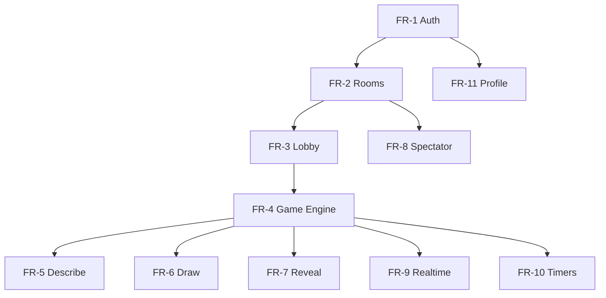

# Document 2 — Functional Requirements

## Overview

Functional requirements define **what** InkEcho must do. Requirements are tagged by priority:

- **P0** — MVP blocker
- **P1** — MVP should-have
- **P2** — Post-MVP

---

## FR-1: Authentication & Identity

| ID | Requirement | Priority |
|----|-------------|----------|
| FR-1.1 | Users may register with email/password or OAuth (Google, GitHub) | P0 |
| FR-1.2 | Users may play as guests with a display name only | P0 |
| FR-1.3 | Guest sessions receive a recoverable session token for reconnect | P0 |
| FR-1.4 | Registered users persist profile, stats, and game history | P1 |
| FR-1.5 | Users may link guest progress to account on signup (same session) | P2 |
| FR-1.6 | Users may log out and invalidate sessions | P0 |
| FR-1.7 | Users may update display name and avatar | P1 |

---

## FR-2: Room Management

| ID | Requirement | Priority |
|----|-------------|----------|
| FR-2.1 | Any user may create a room (public or private) | P0 |
| FR-2.2 | Private rooms require an invite code or link | P0 |
| FR-2.3 | Public rooms appear in a browsable lobby list | P1 |
| FR-2.4 | Users join rooms via code, link, or public list | P0 |
| FR-2.5 | Room host may configure: max players, round count, timers, NSFW filter | P0 |
| FR-2.6 | Room host may kick players from lobby | P0 |
| FR-2.7 | Room host may transfer host role | P1 |
| FR-2.8 | Players may leave a room at any time | P0 |
| FR-2.9 | Room closes when empty or after configurable idle TTL | P0 |
| FR-2.10 | Room code is short, unique, and case-insensitive | P0 |

---

## FR-3: Lobby & Ready State

| ID | Requirement | Priority |
|----|-------------|----------|
| FR-3.1 | Lobby displays all connected players with avatars and ready status | P0 |
| FR-3.2 | Players toggle ready before game start | P0 |
| FR-3.3 | Host may start game when minimum players ready | P0 |
| FR-3.4 | Lobby broadcasts join/leave/ready events in realtime | P0 |
| FR-3.5 | Late joiners enter lobby; cannot join mid-game (spectate only) | P0 |
| FR-3.6 | Host sees player count vs max capacity | P0 |

---

## FR-4: Game Engine

| ID | Requirement | Priority |
|----|-------------|----------|
| FR-4.1 | Game assigns alternating DESCRIBE and DRAW turns per chain rules | P0 |
| FR-4.2 | Each player receives one starting prompt or inherits prior step | P0 |
| FR-4.3 | System shuffles turn order each round set | P0 |
| FR-4.4 | Game enforces turn timers with visible countdown | P0 |
| FR-4.5 | Auto-submit on timer expiry (best-effort content) | P0 |
| FR-4.6 | Game pauses if host requests (host-only) | P1 |
| FR-4.7 | Game skips disconnected player after grace period | P0 |
| FR-4.8 | Game completes all chains before reveal phase | P0 |
| FR-4.9 | Minimum 3 players required to start | P0 |
| FR-4.10 | Maximum players configurable (default 8, max 12) | P0 |

---

## FR-5: Describe Phase

| ID | Requirement | Priority |
|----|-------------|----------|
| FR-5.1 | Player sees prior drawing (if not first in chain) | P0 |
| FR-5.2 | Player enters text description (char limit enforced) | P0 |
| FR-5.3 | Profanity filter optional per room | P1 |
| FR-5.4 | Submit locks input and advances turn | P0 |
| FR-5.5 | Empty submit blocked unless timer expired | P0 |

---

## FR-6: Draw Phase

| ID | Requirement | Priority |
|----|-------------|----------|
| FR-6.1 | Player sees prior text description | P0 |
| FR-6.2 | Canvas supports brush, color picker, eraser, clear | P0 |
| FR-6.3 | Undo/redo stack (min 20 steps) | P0 |
| FR-6.4 | Touch and stylus support with pressure where available | P0 |
| FR-6.5 | Submit exports drawing to storage and advances turn | P0 |
| FR-6.6 | Blank canvas submit blocked unless timer expired | P0 |
| FR-6.7 | Autosave draft locally during turn | P1 |

---

## FR-7: Reveal Phase

| ID | Requirement | Priority |
|----|-------------|----------|
| FR-7.1 | After all turns, reveal each chain sequentially | P0 |
| FR-7.2 | Reveal shows prompt → drawing → description → … animation | P0 |
| FR-7.3 | Players may vote funniest chain (optional scoring) | P1 |
| FR-7.4 | Host may return to lobby for rematch | P0 |
| FR-7.5 | Share link to replay summary | P2 |

---

## FR-8: Spectator Mode

| ID | Requirement | Priority |
|----|-------------|----------|
| FR-8.1 | Non-players may spectate in-progress games | P0 |
| FR-8.2 | Spectators see phase and timer but not hidden content early | P0 |
| FR-8.3 | Spectators see reveal with players | P0 |
| FR-8.4 | Spectator count visible in room | P1 |

---

## FR-9: Realtime Synchronization

| ID | Requirement | Priority |
|----|-------------|----------|
| FR-9.1 | All room state changes propagate via Ably within 500ms P95 | P0 |
| FR-9.2 | Presence tracks online/disconnected players | P0 |
| FR-9.3 | Reconnect restores session within same room slot | P0 |
| FR-9.4 | Server is authoritative for game state transitions | P0 |
| FR-9.5 | Optimistic UI with rollback on conflict | P1 |

---

## FR-10: Timers

| ID | Requirement | Priority |
|----|-------------|----------|
| FR-10.1 | Separate timers for describe and draw phases | P0 |
| FR-10.2 | Timer syncs from server epoch, not client clock | P0 |
| FR-10.3 | Warning state at 25% and 10% remaining | P0 |
| FR-10.4 | Timer pauses when game paused | P1 |
| FR-10.5 | Late reconnect receives remaining time | P0 |

---

## FR-11: Profile & History

| ID | Requirement | Priority |
|----|-------------|----------|
| FR-11.1 | Registered users view game history list | P1 |
| FR-11.2 | History shows date, room, placement, chains played | P1 |
| FR-11.3 | Stats: games played, wins, chains completed | P1 |
| FR-11.4 | Achievements and badges (extensible) | P2 |

---

## FR-12: Admin & Moderation

| ID | Requirement | Priority |
|----|-------------|----------|
| FR-12.1 | Admins view reported content queue | P1 |
| FR-12.2 | Admins ban users (temporary/permanent) | P1 |
| FR-12.3 | Admins view aggregate analytics dashboard | P2 |
| FR-12.4 | Auto-flag NSFW drawings via reporting (manual review) | P2 |

---

## FR-13: UI & UX

| ID | Requirement | Priority |
|----|-------------|----------|
| FR-13.1 | Dark mode default; light mode toggle | P0 |
| FR-13.2 | Fully responsive layouts (320px–2560px) | P0 |
| FR-13.3 | Keyboard shortcuts for canvas tools (desktop) | P1 |
| FR-13.4 | Toast notifications for errors and success | P0 |
| FR-13.5 | Loading skeletons for async views | P0 |
| FR-13.6 | Accessible focus states and ARIA labels | P0 |

---

## FR-14: Notifications

| ID | Requirement | Priority |
|----|-------------|----------|
| FR-14.1 | In-app toasts for join, kick, turn start, timer warning | P0 |
| FR-14.2 | Browser tab title updates on your turn | P1 |
| FR-14.3 | Email notifications | P2 |

---

## Dependencies Between Requirements

---

## Traceability

Each functional requirement maps to user stories (Document 4) and acceptance criteria (Document 5).
