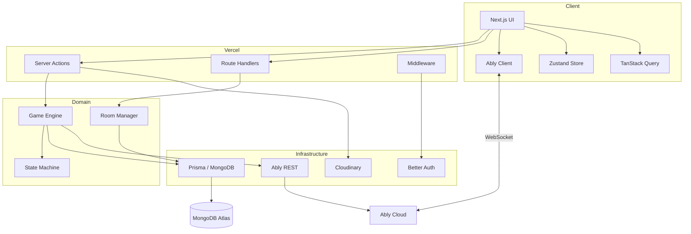
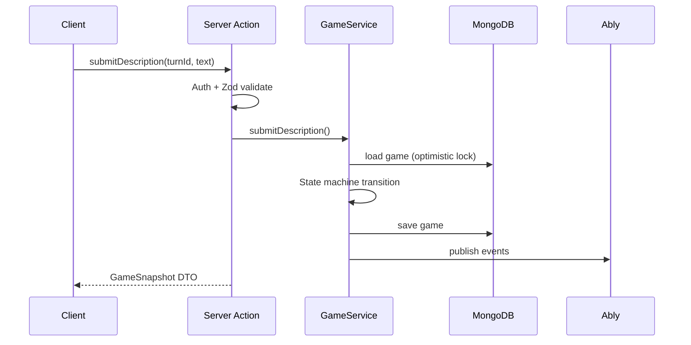
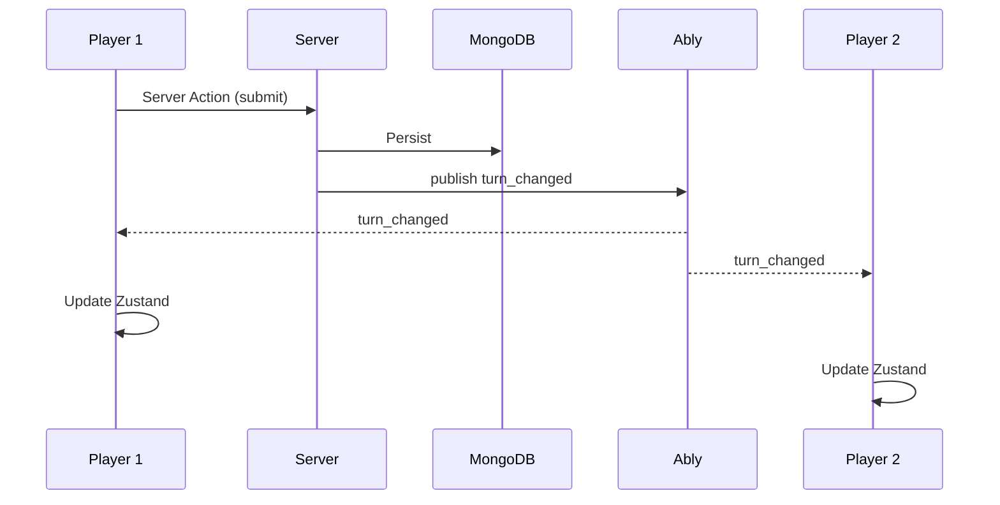
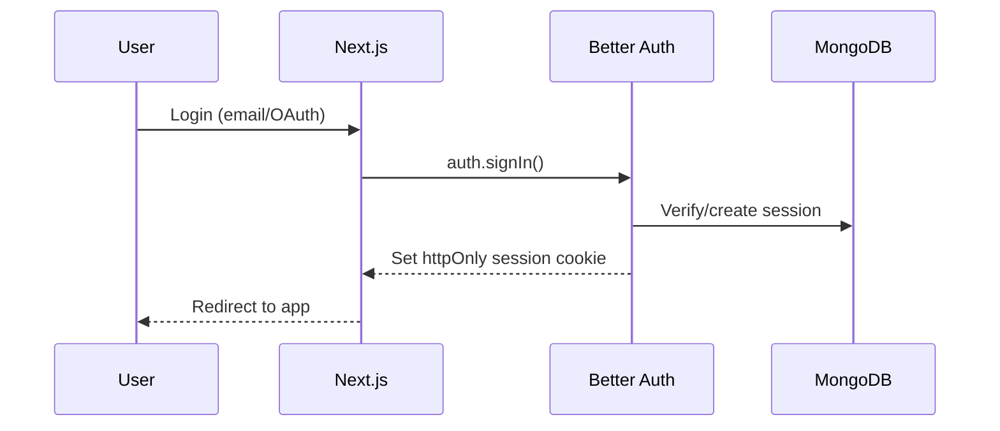

# Document 6 — System Architecture

## Overview

InkEcho follows **Clean Architecture** with a **feature-based** module layout. The system is **server-authoritative** for game state, with **Ably** for realtime fan-out and **optimistic UI** on the client.

---

## Architectural Layers

```
┌─────────────────────────────────────────────────────────────┐
│                    Presentation Layer                        │
│  Next.js App Router │ React Components │ Zustand │ RQ       │
└────────────────────────────┬────────────────────────────────┘
                             │
┌────────────────────────────▼────────────────────────────────┐
│                    Application Layer                         │
│  Server Actions │ Route Handlers │ Use Cases │ DTOs         │
└────────────────────────────┬────────────────────────────────┘
                             │
┌────────────────────────────▼────────────────────────────────┐
│                      Domain Layer                            │
│  Entities │ Value Objects │ Game State Machine │ Events     │
└────────────────────────────┬────────────────────────────────┘
                             │
┌────────────────────────────▼────────────────────────────────┐
│                   Infrastructure Layer                       │
│  Prisma Repos │ Ably │ Cloudinary │ Better Auth │ Sentry    │
└─────────────────────────────────────────────────────────────┘
```

### Layer Responsibilities

| Layer | Responsibility | Depends On |
|-------|----------------|------------|
| **Presentation** | UI, hooks, client state, animations | Application (via actions/API) |
| **Application** | Orchestration, validation, auth checks | Domain + Infrastructure |
| **Domain** | Pure game rules, state transitions | Nothing external |
| **Infrastructure** | DB, realtime, storage, external APIs | Domain interfaces |

---

## High-Level Component Diagram



---

## Request Flow (HTTP / Server Actions)

### Example: Submit Description

```
1. Client: form submit → Server Action `submitDescription`
2. Middleware: validate session (guest or registered)
3. Action: Zod validate input DTO
4. Application Service: load game + turn from repository
5. Domain: GameEngine.validateTransition(SUBMIT_DESCRIPTION)
6. Domain: apply transition → new state
7. Repository: persist game document (transaction)
8. Ably Service: publish `description_submitted` + `turn_changed`
9. Action: return success DTO + updated snapshot
10. Client: reconcile Zustand; TanStack Query invalidate
```



---

## Realtime Flow

### Channel Strategy

| Channel | Pattern | Purpose |
|---------|---------|---------|
| `room:{roomId}` | Pub/Sub | Room-wide game events |
| `room:{roomId}:presence` | Presence | Online/offline tracking |
| `user:{userId}` | Pub/Sub | Personal notifications (optional) |

### Event Flow

```
1. Server persists state change (source of truth)
2. Server publishes to Ably via REST API
3. All subscribed clients receive event
4. Client reducer applies event to local store
5. If event version < local version → fetch full snapshot
```



### Conflict Resolution

- Each game document has `version` (monotonic integer)
- Writes use compare-and-set: `{ _id, version: expected }`
- On conflict: return 409 + latest snapshot; client reconciles
- Realtime events include `version` for ordering

---

## Authentication Flow

### Registered User



### Guest Player

```
1. Guest enters display name
2. Server creates GuestSession record (UUID, roomId, expiresAt)
3. Signed JWT stored in httpOnly cookie (`ink_player_session`)
4. JWT claims: guestSessionId, playerId, roomId
5. On reconnect: validate JWT → restore player slot if room active
```

### Ably Token Auth

```
1. Client requests token via GET /api/realtime/token?roomId=...
2. Server validates user/guest session + room membership
3. Server requests Ably TokenRequest with capability:
   { "room:{roomId}": ["subscribe", "presence", "publish"] }
4. Client uses token to connect; token TTL = 1 hour, auto-refresh
```

---

## Database Flow

### Read Patterns

| Pattern | Strategy |
|---------|----------|
| Room by code | Indexed lookup `Room.code` |
| Active game | `Game.roomId` + status |
| Player session | `GuestSession.token` / User session |
| Public rooms | Paginated, status=LOBBY, visibility=PUBLIC |

### Write Patterns

| Pattern | Strategy |
|---------|----------|
| Turn submit | Single document update with version check |
| Room create | Insert room + host participant atomically |
| Game start | Transaction: room status + game create + chain init |

### Caching

| Data | Cache | TTL |
|------|-------|-----|
| Room snapshot | TanStack Query | stale 5s |
| Public room list | TanStack Query | stale 30s |
| Game state | Zustand (client) | event-driven invalidation |
| Ably token | Memory | until expiry - 5min |

---

## Feature Module Boundaries

```
src/
├── features/
│   ├── auth/
│   ├── rooms/
│   ├── lobby/
│   ├── game/
│   ├── canvas/
│   ├── reveal/
│   ├── profile/
│   └── admin/
├── shared/
│   ├── ui/
│   ├── lib/
│   ├── config/
│   └── types/
└── infrastructure/
    ├── db/
    ├── realtime/
    ├── storage/
    └── monitoring/
```

Each feature owns: `components/`, `hooks/`, `services/`, `schemas/`, `types/`, `actions/`

---

## Key Design Decisions

| Decision | Rationale | Tradeoff |
|----------|-----------|----------|
| Server Actions for mutations | Type-safe, colocated with UI | Not for public 3rd-party API |
| Route Handlers for token/public API | REST for Ably token, webhooks | Two entry patterns |
| MongoDB documents for game state | Nested chains/turns fit naturally | Complex queries need careful indexing |
| Zustand for in-game UI state | Low boilerplate, fast updates | Not for server cache (use RQ) |
| Server-authoritative timer | Prevents clock cheat | Requires server time broadcast |
| Event sourcing lite (version + events) | Easier reconnect | Not full event store |

---

## Cross-Cutting Concerns

| Concern | Implementation |
|---------|----------------|
| Validation | Zod at all boundaries |
| Logging | Pino with `correlationId` |
| Errors | `AppError` hierarchy → mapped HTTP codes |
| Config | `@/shared/config` — no hardcoded values |
| i18n-ready | `@/shared/constants/copy` |

---

## Scalability Notes

- **Horizontally scalable**: Stateless Vercel functions; no sticky sessions
- **Room isolation**: Each room = separate Ably channel; no cross-room broadcasts
- **DB sharding path**: Shard key `roomId` if MongoDB scale needed
- **Asset offload**: Drawings on Cloudinary CDN, not DB blobs

---

## Related Documents

- Database: Document 7, 8
- API: Document 9
- Realtime: Document 10
- Game logic: Document 11
- Security: Document 13
- Deployment: Document 15
