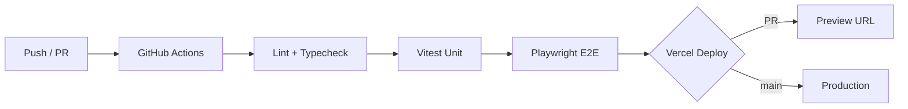

# Document 15 — Deployment Architecture

## Overview

InkEcho deploys as a **monolithic Next.js application** on **Vercel**, with managed services for database, realtime, storage, and monitoring. This minimizes operational overhead while supporting horizontal scale.

---

## Environment Topology

```
┌─────────────────────────────────────────────────────────────────┐
│                         PRODUCTION                               │
├─────────────────────────────────────────────────────────────────┤
│  Vercel (Next.js 15)                                            │
│  ├── Edge Network (CDN, Middleware)                             │
│  ├── Serverless Functions (Route Handlers, Server Actions)      │
│  └── Static Assets (/_next/static)                              │
├─────────────────────────────────────────────────────────────────┤
│  MongoDB Atlas (M10+ cluster)                                   │
│  Ably (Production app)                                          │
│  Cloudinary (Production cloud)                                  │
│  Sentry (Production project)                                    │
│  Upstash Redis (Rate limiting) — optional                       │
└─────────────────────────────────────────────────────────────────┘

┌─────────────────────────────────────────────────────────────────┐
│                          STAGING                                 │
│  Vercel Preview + MongoDB Atlas (staging cluster)              │
│  Ably (Staging app)                                             │
│  Cloudinary (Staging folder prefix)                             │
└─────────────────────────────────────────────────────────────────┘

┌─────────────────────────────────────────────────────────────────┐
│                         DEVELOPMENT                              │
│  localhost:3000 + MongoDB local/Docker OR Atlas dev cluster     │
│  Ably (Dev app)                                                 │
└─────────────────────────────────────────────────────────────────┘
```

---

## Vercel Configuration

### Project Settings

| Setting | Value |
|---------|-------|
| Framework | Next.js |
| Node.js | 20 LTS |
| Build command | `pnpm build` |
| Output | Default (not static export) |
| Regions | `iad1` primary (configurable) |

### Domains

| Environment | Domain |
|-------------|--------|
| Production | `inkecho.app` (example) |
| Staging | `staging.inkecho.app` |
| Preview | `*.vercel.app` |

### vercel.json (minimal)

```json
{
  "headers": [
    {
      "source": "/(.*)",
      "headers": [
        { "key": "X-Content-Type-Options", "value": "nosniff" },
        { "key": "X-Frame-Options", "value": "DENY" },
        { "key": "Referrer-Policy", "value": "strict-origin-when-cross-origin" }
      ]
    }
  ]
}
```

Security headers also set in Next.js middleware (Document 13).

---

## CI/CD Pipeline



### GitHub Actions Workflow

```yaml
# .github/workflows/ci.yml (planned Phase 2)
on: [push, pull_request]
jobs:
  ci:
    runs-on: ubuntu-latest
    steps:
      - uses: actions/checkout@v4
      - uses: pnpm/action-setup@v4
      - run: pnpm install --frozen-lockfile
      - run: pnpm lint
      - run: pnpm typecheck
      - run: pnpm test
      - run: pnpm test:e2e # against preview or local
```

### Branch Strategy

| Branch | Deploy |
|--------|--------|
| `main` | Production (auto) |
| `develop` | Staging |
| `feature/*` | Preview per PR |
| `hotfix/*` | Preview → fast-track to main |

---

## Database Deployment

### MongoDB Atlas

| Environment | Tier | Region |
|-------------|------|--------|
| Production | M10+ | Same as Vercel region |
| Staging | M0/M2 | Same region |
| Dev | Local Docker or M0 | — |

### Migrations

```bash
# Deploy flow
pnpm prisma migrate deploy   # CI/CD on production
pnpm prisma db seed          # PromptPool, achievements (staging/prod once)
```

- Migrations run in CI before deploy promotion
- Backward-compatible only — no destructive migrations on live games
- Atlas backups: continuous + PITR enabled on production

---

## External Services

### Ably

| Environment | App | Channels |
|-------------|-----|----------|
| Production | `inkecho-prod` | `room:{roomId}` |
| Staging | `inkecho-staging` | Same pattern |
| Dev | `inkecho-dev` | Same pattern |

Server uses REST API with root API key (Vercel env). Clients use token auth.

### Cloudinary

| Setting | Value |
|---------|-------|
| Folder | `inkecho/{env}/drawings/` |
| Upload preset | Signed uploads via server |
| Transformations | `f_auto,q_auto,w_800` |
| Lifecycle | 90-day delete rule |

### Sentry

| Setting | Value |
|---------|-------|
| DSN | Per-environment |
| Source maps | Uploaded in CI (`@sentry/nextjs`) |
| Sample rate | 100% errors, 10% performance (prod) |

### Better Auth

| Setting | Value |
|---------|-------|
| Base URL | Environment-specific |
| Trusted origins | Vercel domains |
| Session storage | MongoDB via Prisma adapter |

---

## Infrastructure Diagram

```
                    ┌──────────────┐
                    │   Users      │
                    └──────┬───────┘
                           │ HTTPS
                           ▼
                    ┌──────────────┐
                    │ Vercel Edge  │
                    │   CDN + MW   │
                    └──────┬───────┘
                           │
              ┌────────────┼────────────┐
              ▼            ▼            ▼
        ┌──────────┐ ┌──────────┐ ┌──────────┐
        │ Static   │ │ Serverless│ │ Serverless│
        │ Assets   │ │ Actions  │ │ Routes   │
        └──────────┘ └─────┬────┘ └─────┬────┘
                           │            │
              ┌────────────┼────────────┼────────────┐
              ▼            ▼            ▼            ▼
        ┌──────────┐ ┌──────────┐ ┌──────────┐ ┌──────────┐
        │ MongoDB  │ │   Ably   │ │Cloudinary│ │  Sentry  │
        │  Atlas   │ │          │ │          │ │          │
        └──────────┘ └──────────┘ └──────────┘ └──────────┘
                           ▲
                           │ WSS
                    ┌──────┴───────┐
                    │   Clients    │
                    └──────────────┘
```

---

## Scaling Strategy

| Component | Scale Method |
|-----------|--------------|
| Vercel functions | Auto-scale per request |
| MongoDB | Vertical → sharding by `roomId` |
| Ably | Managed; per-channel isolation |
| Cloudinary | Managed CDN |
| Rate limiting | Upstash Redis horizontal |

**Bottleneck prediction:** MongoDB write rate during peak turn submissions. Mitigate with single-document updates and connection pooling.

---

## Rollback Procedure

1. Identify issue via Sentry / monitoring
2. Vercel → Deployments → Promote previous deployment (< 2 min)
3. If migration issue → run down migration or hotfix forward
4. If Ably/Cloudinary issue → rotate keys if compromised
5. Post-incident review within 48h

---

## Scheduled Jobs

| Job | Schedule | Implementation |
|-----|----------|----------------|
| Inactive room cleanup | Every 15 min | Vercel Cron → `/api/cron/cleanup-rooms` |
| Expired guest sessions | MongoDB TTL | Automatic |
| Stats aggregation | Post-MVP | Cron |
| Cloudinary orphan cleanup | Weekly | Cron |

Cron routes protected by `CRON_SECRET` header.

---

## Disaster Recovery

| Scenario | RPO | RTO | Procedure |
|----------|-----|-----|-----------|
| Vercel outage | 0 | Wait | Status page; communicate |
| MongoDB failure | 1h | 4h | Atlas PITR restore |
| Ably outage | 0 | Wait | Show degraded banner; queue actions |
| Full region loss | 1h | 8h | Failover Atlas region; update DNS |

---

## Pre-Launch Checklist

- [ ] Production env vars set in Vercel
- [ ] MongoDB Atlas IP allowlist (Vercel IPs or 0.0.0.0/0 with strong auth)
- [ ] Ably production app configured
- [ ] Cloudinary signed upload enabled
- [ ] Sentry source maps uploading
- [ ] DNS configured with SSL
- [ ] Cron jobs registered
- [ ] Health endpoint monitored
- [ ] Staging smoke test passed

---

## Related Documents

- Environment variables: Document 16
- Security: Document 13
- Performance: Document 14
