# Phase 1 — Document 2: User Flows

## Overview

User flows map every primary journey from entry to outcome. Each flow notes **entry point**, **decisions**, **success state**, and **error exits**.

---

## Flow 1: First-Time Visitor → Play (Guest, Happy Path)

**Goal:** Land → create room → friends join → play within 60 seconds.

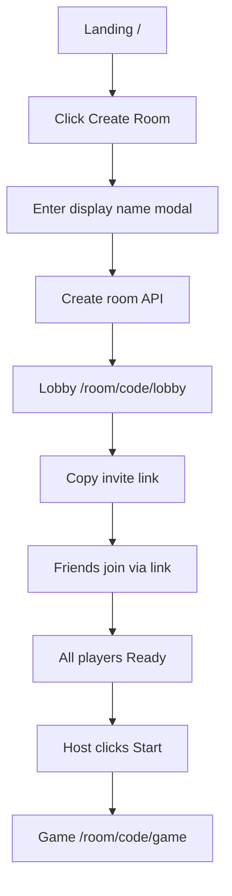

| Step | UI | System |
|------|-----|--------|
| 1 | Hero CTA "Create Room" | — |
| 2 | Name modal (3–20 chars) | Create guest session if needed |
| 3 | Redirect to lobby | Room created, user = host |
| 4 | Share sheet / copy link | Clipboard API |
| 5 | Friends: join flow | Realtime `player_joined` |
| 6 | Ready toggles | `player_ready_changed` |
| 7 | Start button enabled ≥3 ready | `game_started` |
| 8 | Game view loads | Timer begins |

**Error exits:** Name invalid → inline error. Create fails → toast + retry.

---

## Flow 2: Join via Invite Link (Guest)

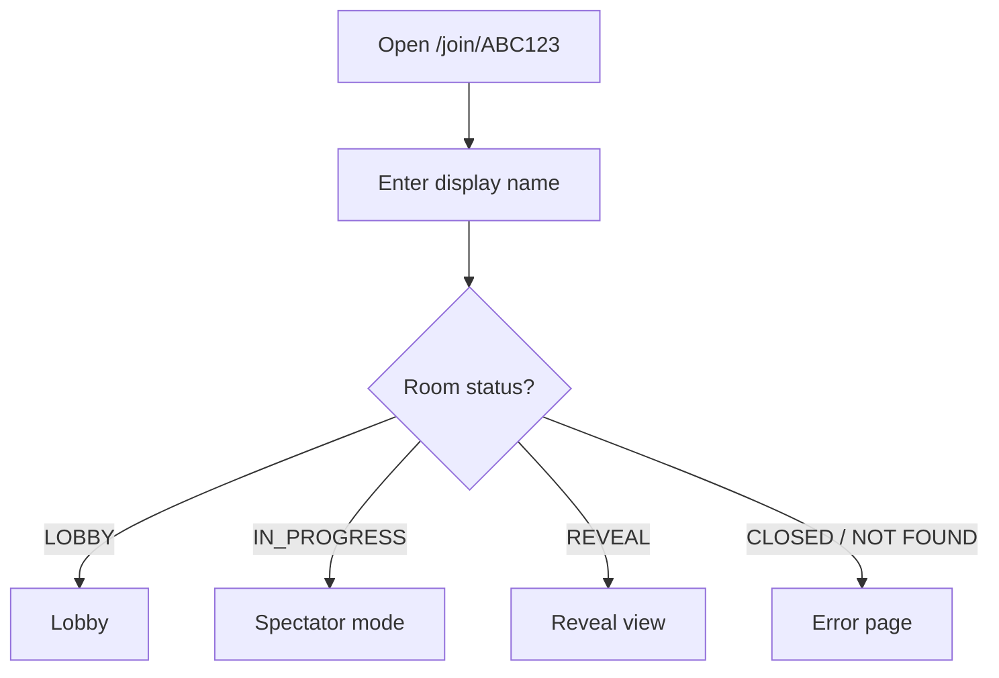

| Step | UI |
|------|-----|
| 1 | Join page with code pre-filled |
| 2 | Name input + Join button |
| 3 | Auto-route by room status |

---

## Flow 3: Join via Code (Manual)

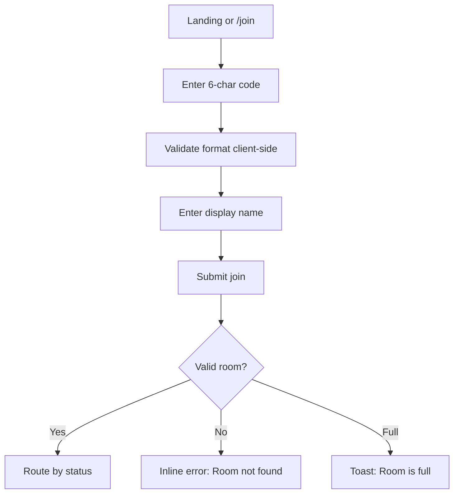

---

## Flow 4: Registered User Login → Play

```mermaid
flowchart TD
    A[Click Login] --> B[/auth/login]
    B --> C{Method?}
    C -->|Email| D[Email + password form]
    C -->|OAuth| E[Google / GitHub]
    D --> F[Session created]
    E --> F
    F --> G{returnUrl?}
    G -->|Yes| H[Redirect to returnUrl]
    G -->|No| I[Landing logged-in state]
    H --> J[Create or Join room]
```

Logged-in users skip name entry — display name from profile (editable in lobby).

---

## Flow 5: Lobby → Game Start

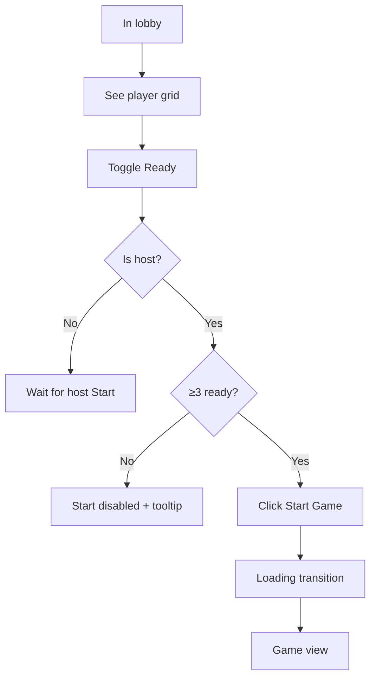

**Host-only actions in lobby:**
- Edit settings (drawer)
- Kick player (confirm dialog)
- Start game
- Transfer host (player card menu)

---

## Flow 6: Describe Turn (Active Player)

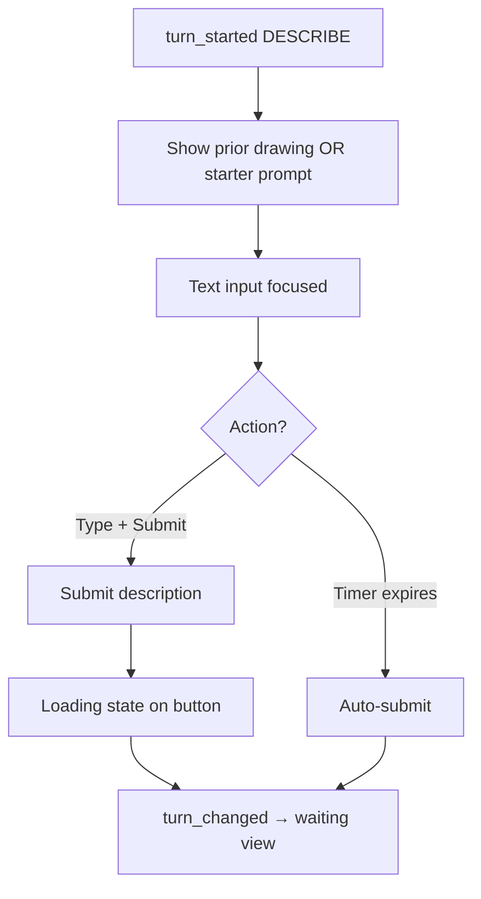

**UI states:**
1. **Active** — input enabled, timer pulsing at 10%
2. **Submitting** — button spinner, input disabled
3. **Success** — brief checkmark → waiting view

---

## Flow 7: Draw Turn (Active Player)

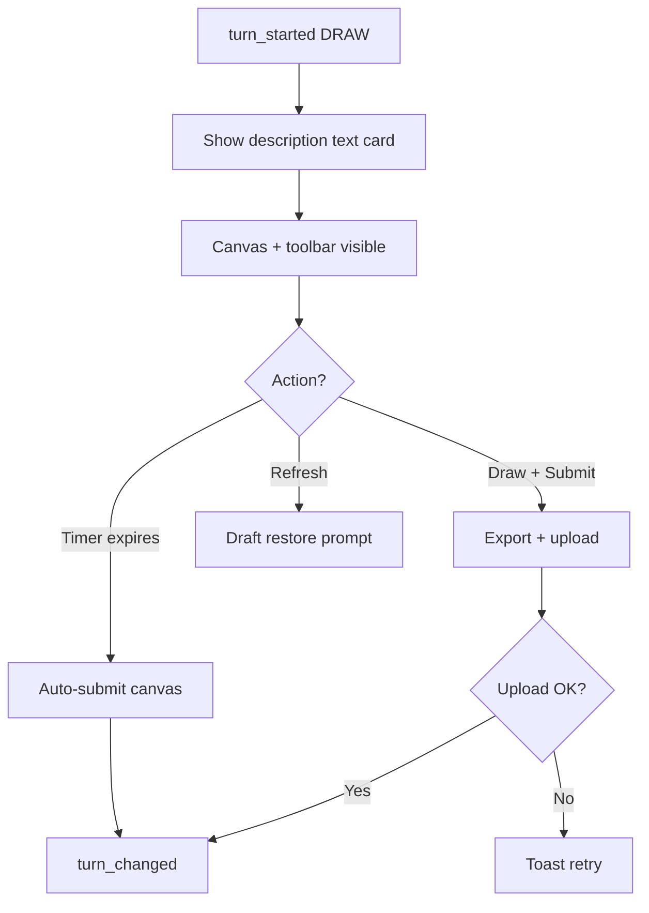

---

## Flow 8: Waiting (Non-Active Player)

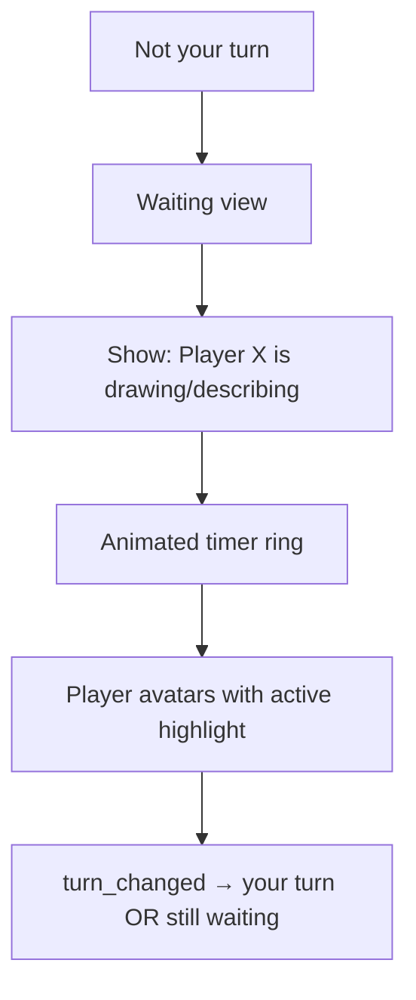

Spectators see identical waiting UI minus "Your turn" alerts.

---

## Flow 9: Disconnect → Reconnect

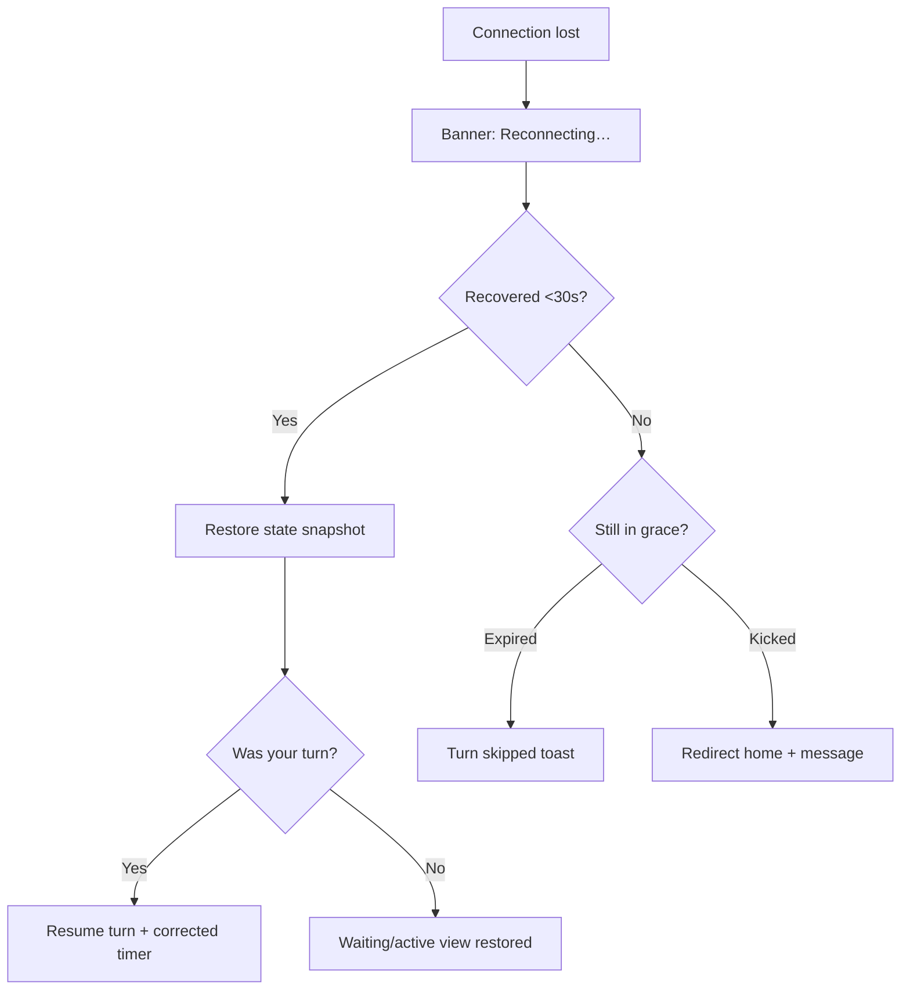

---

## Flow 10: Game Complete → Reveal

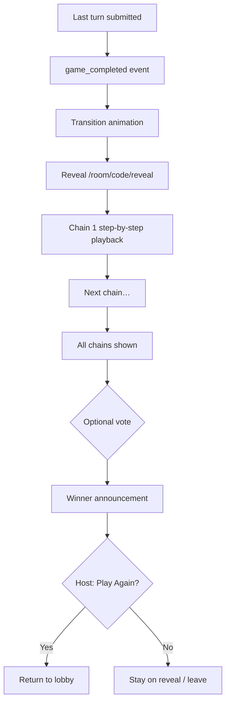

---

## Flow 11: Spectator Mid-Game Join

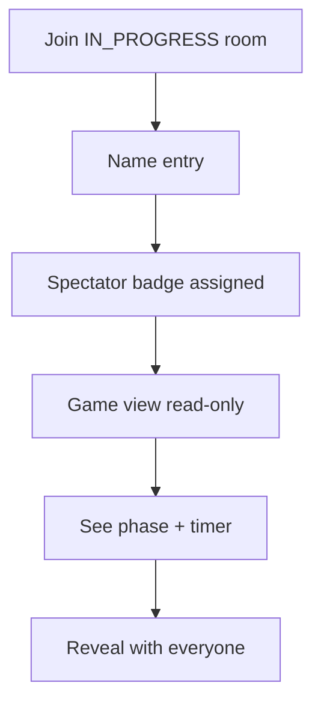

---

## Flow 12: Host Kick Player

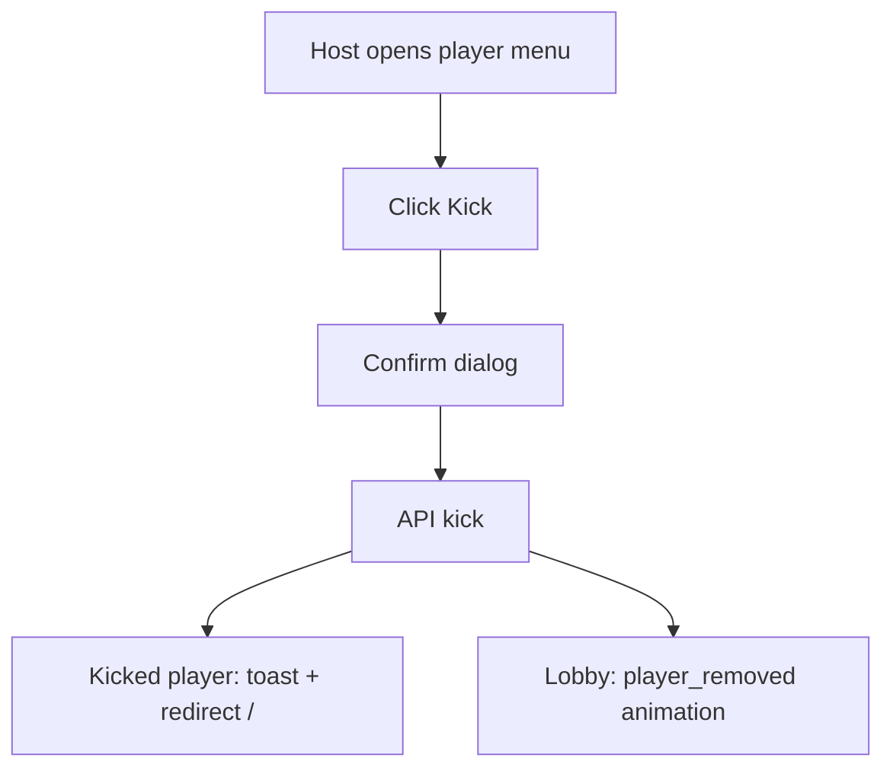

---

## Flow 13: Profile & History (Registered)

```mermaid
flowchart TD
    A[Avatar → Profile] --> B[/profile]
    B --> C[Stats cards + recent games]
    C --> D[Click View All History]
    D --> E[/profile/history paginated list]
    E --> F[Click game row]
    F --> G[Game detail / reveal replay P2]
```

---

## Flow 14: Report Content

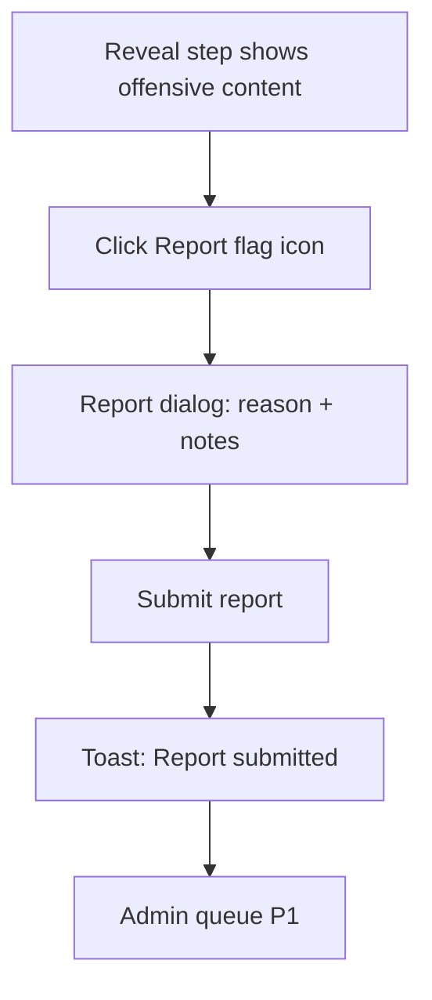

---

## Flow 15: Admin Moderation

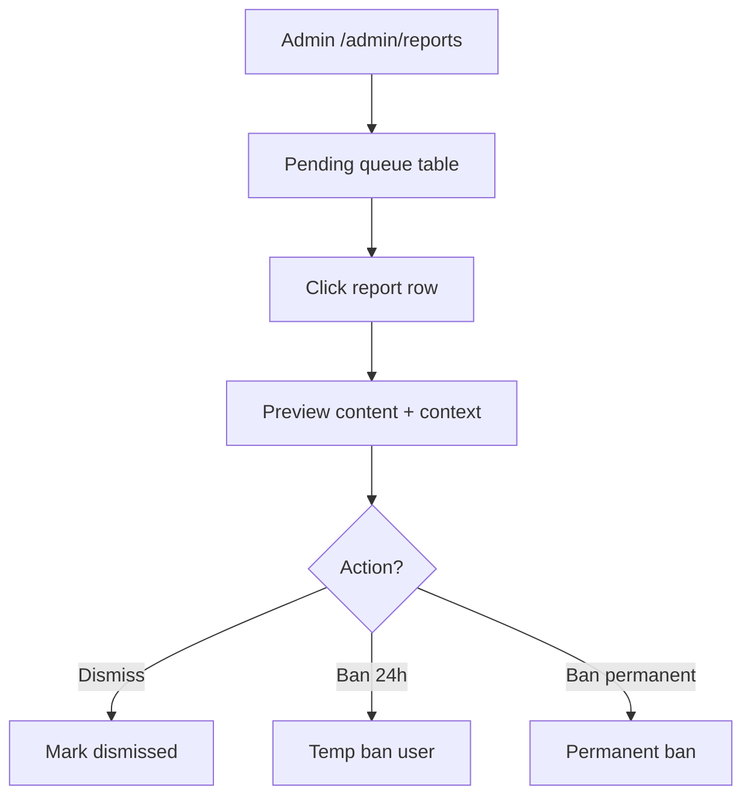

---

## Emotional Journey Map

| Phase | User feeling | UI supports with |
|-------|--------------|------------------|
| Landing | Curious | Bold hero, playful illustration, clear CTAs |
| Join | Anticipation | Fast form, minimal fields |
| Lobby | Social energy | Avatar grid, ready states, live presence |
| Your turn | Focus + pressure | Timer, clean canvas, no distractions |
| Waiting | Suspense | Active player highlight, countdown |
| Reveal | Delight + laughter | Sequential animations, big visuals |
| Rematch | Momentum | One-click Play Again |

---

## Flow Priority (MVP)

| Priority | Flows |
|----------|-------|
| **P0** | 1, 2, 3, 5, 6, 7, 8, 9, 10 |
| **P1** | 4, 11, 12, 13, 14 |
| **P2** | 15, profile replay |

---

## Related Documents

- Sitemap: [01-sitemap-and-navigation.md](./01-sitemap-and-navigation.md)
- Wireframes: [03-wireframes.md](./03-wireframes.md)
- Animation: [06-animation-system.md](./06-animation-system.md)
