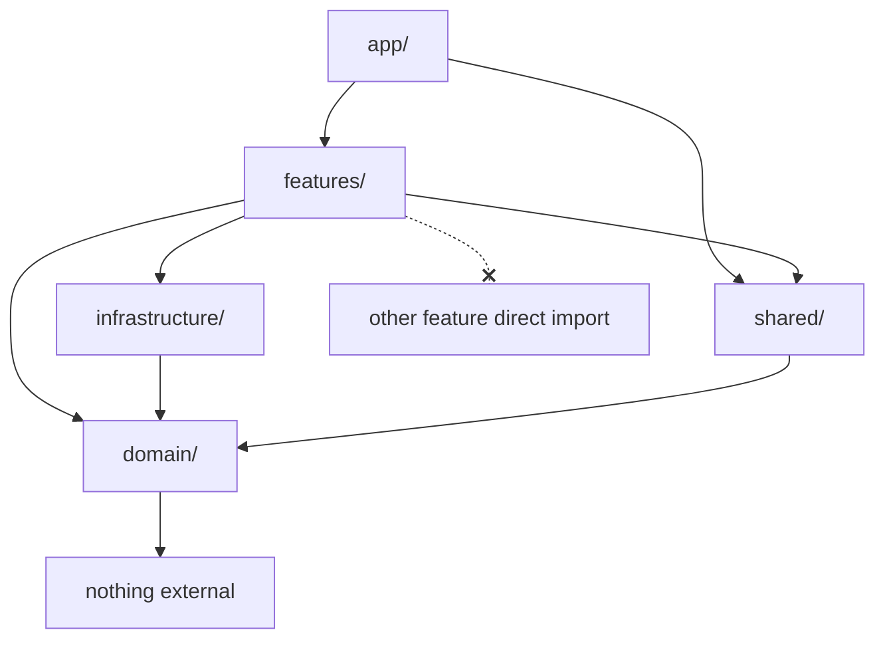

# Phase 2 — Document 1: Folder Architecture Overview

## Purpose

This document defines **how code is organized** in InkEcho before any implementation begins. The structure enforces Clean Architecture, feature isolation, and scalability for a team-sized codebase.

**Path alias:** `@/` → `src/`

---

## Architectural Layers → Folders

```
┌─────────────────────────────────────────────────────────────────┐
│  PRESENTATION                                                    │
│  src/app/          Next.js routes (thin)                         │
│  src/features/     UI, hooks, actions, feature services          │
│  src/shared/ui/    Design system components                      │
└────────────────────────────┬────────────────────────────────────┘
                             │ calls
┌────────────────────────────▼────────────────────────────────────┐
│  APPLICATION                                                     │
│  src/features/*/actions/     Server Actions                      │
│  src/features/*/services/    Use-case orchestration              │
│  src/app/api/                Route Handlers (public/cron/token)  │
└────────────────────────────┬────────────────────────────────────┘
                             │ calls
┌────────────────────────────▼────────────────────────────────────┐
│  DOMAIN (pure — zero infrastructure imports)                     │
│  src/domain/               State machines, rules, value objects    │
└────────────────────────────▲────────────────────────────────────┘
                             │ implements interfaces
┌────────────────────────────┴────────────────────────────────────┐
│  INFRASTRUCTURE                                                  │
│  src/infrastructure/   Prisma, Ably, Cloudinary, auth, monitoring│
└─────────────────────────────────────────────────────────────────┘

         CROSS-CUTTING: src/shared/config, lib, constants, types
```

---

## Top-Level Repository Layout

```
InkEcho/
├── .github/                 CI workflows, PR templates
├── .husky/                  Git hooks (pre-commit)
├── docs/                    Design documentation (Phase 0–7)
├── prisma/                  Schema, migrations, seed
├── public/                  Static assets (icons, OG images)
├── scripts/                 Dev/ops scripts (seed, cleanup)
├── tests/                   E2E, load, shared test utilities
├── src/                     Application source
├── .env.example             Env template (committed)
├── .eslintrc.cjs            Lint rules + import boundaries
├── .prettierrc              Formatting
├── components.json          shadcn/ui config
├── middleware.ts            Auth, correlation ID, security headers
├── next.config.ts           Next.js configuration
├── package.json
├── playwright.config.ts
├── postcss.config.js
├── tailwind.config.ts       Design tokens → Tailwind
├── tsconfig.json
└── vitest.config.ts
```

| Folder / File | Why it exists |
|---------------|---------------|
| `.github/` | CI pipeline runs lint, typecheck, test on every PR |
| `.husky/` | Enforces quality gates before commit |
| `docs/` | Single source of truth for architecture (this repo) |
| `prisma/` | Database schema lives outside `src` (Prisma convention) |
| `public/` | Files served as-is by Next.js (`/favicon.ico`, etc.) |
| `scripts/` | One-off maintenance scripts not imported by app |
| `tests/` | E2E and load tests separated from unit tests in `src/` |
| `middleware.ts` | Root-level Next.js middleware entry |

---

## `src/` Layer Breakdown

### 1. `src/app/` — Presentation (Routes Only)

**Rule:** Route files are **thin**. They compose feature components and pass params. No business logic.

```
app/
├── (marketing)/             Route group — shared marketing layout
├── (auth)/                  Route group — auth layout (centered card)
├── (game)/                  Route group — room/game layouts
├── api/                     Route Handlers only
├── layout.tsx               Root layout (providers)
├── globals.css              CSS variables / design tokens
└── not-found.tsx
```

### 2. `src/features/` — Feature Modules

Each feature is a **vertical slice** owning its UI, hooks, actions, schemas, and application services.

| Feature | Responsibility |
|---------|------------------|
| `marketing` | Landing, how-it-works, footer |
| `auth` | Login, register, guest session, OAuth |
| `rooms` | Create, join, browse, room settings |
| `lobby` | Ready state, player grid, kick, invite |
| `game` | Turn phases, timer UI, game store |
| `canvas` | Drawing engine, toolbar, export |
| `reveal` | Chain playback, voting, rematch |
| `realtime` | Ably client hook, event reducer |
| `profile` | Stats, history, achievements |
| `admin` | Reports, bans, analytics |

**Standard feature subfolders:**

| Subfolder | Contains |
|-----------|----------|
| `components/` | React components (feature-specific) |
| `hooks/` | Client hooks |
| `actions/` | Server Actions (`'use server'`) |
| `services/` | Application services (orchestration) |
| `schemas/` | Zod input/output schemas |
| `types/` | Feature TypeScript types |
| `stores/` | Zustand slices (if needed) |
| `lib/` | Pure helpers scoped to feature |
| `index.ts` | Public exports (optional barrel) |

### 3. `src/domain/` — Pure Business Logic

**Rule:** No imports from `infrastructure/`, `features/`, or `app/`. No React, no Prisma, no Ably.

```
domain/
├── room/                    Room state machine, code generation rules
├── game/                    Game state machine, turn order, chain logic
├── timer/                   Timer calculation (pure)
├── player/                  Player role rules, visibility filters
└── shared/                  Result type, domain errors, value objects
```

### 4. `src/infrastructure/` — External Systems

Implements data access and third-party integrations. Called by feature services, never by components directly.

```
infrastructure/
├── db/                      Prisma client, repositories
├── auth/                    Better Auth config, guest JWT
├── realtime/                Ably server publish + token generation
├── storage/                 Cloudinary upload/delete
├── cache/                   Upstash rate limiting
└── monitoring/              Pino logger, Sentry helpers
```

### 5. `src/shared/` — Cross-Cutting Utilities

Code used by **two or more features** that is not domain logic and not infrastructure.

```
shared/
├── ui/                      shadcn components + layout + motion wrappers
├── lib/                     cn(), errors, result, auth helpers
├── config/                  GAME_CONFIG, theme, env validation
├── constants/               Copy strings, query keys, event names
├── types/                   Shared DTOs, API response shapes
└── providers/               React context providers (Query, Theme)
```

---

## Dependency Rules (Import Boundaries)



| From → To | Allowed? | Notes |
|-----------|----------|-------|
| `app/` → `features/` | ✓ | Primary pattern |
| `app/` → `shared/` | ✓ | Providers, layout |
| `features/A/` → `features/B/` | ✗ | Use `shared/` or event bus pattern |
| `features/` → `domain/` | ✓ | Domain rules |
| `features/` → `infrastructure/` | ✓ | Via services only, not components |
| `features/*/components/` → `infrastructure/` | ✗ | Components use hooks/actions |
| `domain/` → `infrastructure/` | ✗ | **Strict — enforced by ESLint** |
| `domain/` → `features/` | ✗ | |
| `infrastructure/` → `domain/` | ✓ | Maps DB → domain types |
| `shared/` → `features/` | ✗ | |
| `shared/` → `infrastructure/` | ✗ | Except in server-only files |

### Cross-Feature Communication

When features must interact (e.g., `game` + `realtime`):

1. **Shared store** — `features/game/stores/` consumed by `features/realtime/hooks/`
2. **Shared types** — `shared/types/game.ts`
3. **Shared constants** — `shared/constants/realtime-events.ts`
4. **Orchestration** — Application service in one feature calls another's service via `shared/lib/di` factory (not direct component import)

Preferred: **`realtime` feature** subscribes to Ably and dispatches to **`game` store** via a registered handler in app providers.

---

## Server vs Client File Conventions

| Pattern | Location | Directive |
|---------|----------|-----------|
| Server Action | `features/*/actions/*.ts` | `'use server'` at top |
| Route Handler | `app/api/**/route.ts` | Default server |
| Server Component | `app/**/page.tsx` | Default (no directive) |
| Client Component | `features/*/components/*.tsx` | `'use client'` when needed |
| Client Hook | `features/*/hooks/*.ts` | `'use client'` if uses React hooks |
| Pure domain | `domain/**/*.ts` | No directive — isomorphic |
| Repository | `infrastructure/db/repositories/*.ts` | Server only |

**Colocation rule:** Keep `'use client'` files as leaf nodes — push server logic up to actions/services.

---

## Testing Colocation

| Test type | Location |
|-----------|----------|
| Unit (domain, lib) | Next to source: `foo.test.ts` |
| Unit (components) | `Component.test.tsx` adjacent |
| Integration | `features/*/services/*.integration.test.ts` |
| E2E | `tests/e2e/*.spec.ts` |
| Load | `tests/load/*.js` |
| Factories | `tests/factories/` |

---

## Naming & File Limits

| Rule | Value |
|------|-------|
| Max component lines | ~150 |
| Max service method lines | ~50 |
| One component per file | Yes |
| Barrel exports | Feature root only; avoid deep barrels |
| Index re-exports | Explicit named exports |

---

## Config & Constants (No Hardcoding)

All magic values live in:

```
shared/config/
├── env.ts                   Zod-validated process.env
├── app.config.ts            App name, URLs
├── game.config.ts           Timers, player limits, grace periods
├── room.config.ts           Code length, TTL
├── canvas.config.ts         Brush palette, export limits
├── motion.config.ts         Animation durations
├── rate-limit.config.ts     Rate limit windows
└── theme.config.ts          Token reference values
```

Copy strings:

```
shared/constants/
├── copy/                    UI strings (i18n-ready)
├── query-keys.ts            TanStack Query keys
├── realtime-events.ts       Ably event name constants
└── routes.ts                Route path helpers
```

---

## Phased Implementation Map

Which folders are built in which milestone:

| Milestone | Folders populated |
|-----------|-------------------|
| **M2** | Root config, `shared/`, `infrastructure/db`, `infrastructure/monitoring`, `app/layout`, shadcn UI |
| **M3** | `features/auth`, `features/rooms`, `features/lobby`, `domain/room`, auth infra |
| **M4** | `features/game`, `features/realtime`, `domain/game`, `domain/timer`, Ably infra |
| **M5** | `features/canvas`, canvas config |
| **M6** | `features/reveal`, `features/profile`, `features/admin`, tests, polish |

---

## ESLint Boundary Enforcement (Phase 2 Plan)

```javascript
// .eslintrc.cjs — eslint-plugin-import or @typescript-eslint/no-restricted-imports
'no-restricted-imports': ['error', {
  patterns: [
    {
      group: ['@/infrastructure/*'],
      importNames: ['*'],
      message: 'Do not import infrastructure from domain',
    },
  ],
}],
```

Separate `eslint.config` rules per folder in M2 setup.

---

## Related Documents

- Complete tree: [02-complete-folder-tree.md](./02-complete-folder-tree.md)
- System architecture: [../phase-0/06-system-architecture.md](../phase-0/06-system-architecture.md)
- Coding standards: [../phase-0/20-coding-standards.md](../phase-0/20-coding-standards.md)
- Sitemap (routes): [../phase-1/01-sitemap-and-navigation.md](../phase-1/01-sitemap-and-navigation.md)

## Approval Gate

Phase 3 (Prisma schema) begins after Phase 2 approval.
