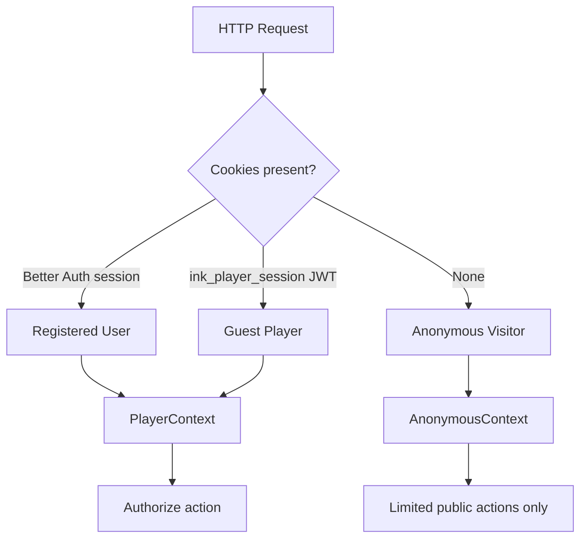
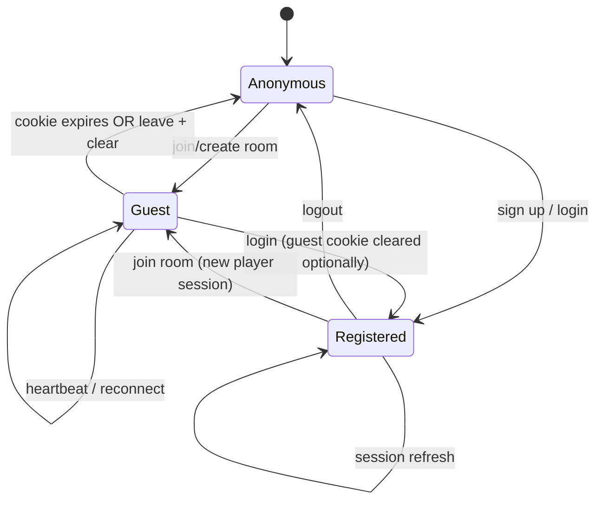

# Phase 4 — Document 1: Authentication Architecture

## Overview

InkEcho supports **three identity modes** that coexist in the same room:

| Mode | Description | Persistence |
|------|-------------|-------------|
| **Anonymous visitor** | No session; can browse landing, read legal pages | None |
| **Guest player** | Display name + room-scoped session | 24 hours |
| **Registered user** | Email/OAuth account via Better Auth | 30 days (rolling) |

A single human may be anonymous → guest → registered within one visit. The system must resolve **who is acting** on every Server Action and Route Handler.

**Implementation homes (M3):**

```
infrastructure/auth/     Better Auth config, guest JWT, session helpers
features/auth/           UI, actions, hooks
shared/lib/auth/         authorize(), permission checks
middleware.ts            Cookie parsing, correlation ID, ban check
```

---

## Identity Model



### PlayerContext (union type)

```typescript
type PlayerContext =
  | {
      type: 'registered';
      userId: string;
      playerId: string;       // UUID for current room
      roomId: string;
      displayName: string;
      role: ParticipantRole;
      sessionId: string;      // Better Auth session id
    }
  | {
      type: 'guest';
      guestSessionId: string;
      playerId: string;
      roomId: string;
      displayName: string;
      role: ParticipantRole;
      tokenJti: string;       // JWT id for revocation check
    };

type AnonymousContext = {
  type: 'anonymous';
};

type AuthContext = PlayerContext | AnonymousContext;
```

---

## Session Storage

### Registered User — Better Auth

| Property | Value |
|----------|-------|
| Cookie name | `better-auth.session_token` (Better Auth default) |
| Storage | `Session` collection in MongoDB |
| Flags | `HttpOnly`, `Secure`, `SameSite=Lax` |
| TTL | 30 days rolling (configurable in Better Auth) |
| Provider | Email/password + Google + GitHub OAuth |

Better Auth handles: sign up, sign in, sign out, OAuth callback, session refresh, email verification.

### Guest Player — Custom JWT

| Property | Value |
|----------|-------|
| Cookie name | `ink_player_session` |
| Storage | `GuestSession` document + signed JWT |
| Flags | `HttpOnly`, `Secure`, `SameSite=Lax` |
| TTL | 24 hours (`GUEST_SESSION_TTL_HOURS`) |
| Algorithm | HS256 with `GUEST_SESSION_SECRET` |

**JWT payload:**

```typescript
{
  sub: guestSessionId;      // GuestSession._id
  jti: token;               // Unique token id (matches GuestSession.token)
  playerId: string;         // UUID v4
  roomId: string;           // Room._id
  displayName: string;
  iat: number;
  exp: number;
}
```

JWT is a **pointer** to the DB record — revocation and expiry checked server-side on every request.

### Anonymous Visitor

No cookie. Can access public routes only. Must create guest session or log in before joining a room.

---

## Dual-Session Precedence

When both cookies exist (user logged in AND guest cookie from prior play):

| Rule | Behavior |
|------|----------|
| In a room route | **Guest/room session takes precedence** for game actions |
| Profile routes | **Better Auth session** required |
| Create room while logged in | Registered user's `name` as default display name; new `playerId` generated |
| After login mid-visit | Prompt optional: "Continue as PlayerOne (account)" — uses registered identity with new playerId |

**Resolution order in `getAuthContext()`:**

```
1. If path is /room/[code]/* and ink_player_session valid → Guest/Registered player in room
2. Else if Better Auth session valid → Registered (no room unless also in participant list)
3. Else → Anonymous
```

---

## Cookie Lifecycle Diagram



---

## Middleware Pipeline

`middleware.ts` runs on matched routes before Server Components / Route Handlers:

```
1. Generate / propagate X-Correlation-Id
2. Apply security headers (Document 13)
3. Parse session cookies (lightweight — no DB)
4. Redirect banned registered users (if user id in JWT/session decode cache)
5. Pass through — full auth in Server Actions
```

**Why not full auth in middleware?** Edge runtime limits Prisma; full validation happens in Node.js Server Actions / Route Handlers.

### Protected Route Rules

| Pattern | Requirement |
|---------|-------------|
| `/profile/*` | Registered session; else redirect `/auth/login?returnUrl=...` |
| `/admin/*` | Registered + `role === ADMIN`; else 403 |
| `/room/[code]/*` | Valid player or spectator session for that room |
| `/auth/login` | Redirect to `/` if already logged in (optional) |
| `/api/profile/*` | Registered session |
| `/api/admin/*` | Admin role |

---

## Authorization Layer

Central module: `shared/lib/auth/authorize.ts`

```typescript
type Permission =
  | 'room:join'
  | 'room:settings'
  | 'room:kick'
  | 'room:start'
  | 'game:submit'
  | 'game:pause'
  | 'profile:read'
  | 'admin:moderate';

function authorize(ctx: AuthContext, permission: Permission, resource?: Resource): void;
// throws ForbiddenError if denied
```

| Permission | Guest | Player | Host | Spectator | Registered | Admin |
|------------|-------|--------|------|-----------|------------|-------|
| `room:join` | ✓ | — | — | — | ✓ | ✓ |
| `room:settings` | — | — | ✓ | — | ✓ | ✓ |
| `room:kick` | — | — | ✓ | — | ✓ | ✓ |
| `room:start` | — | — | ✓ | — | ✓ | ✓ |
| `game:submit` | — | ✓ own turn | ✓ own turn | — | ✓ | — |
| `game:pause` | — | — | ✓ | — | ✓ | ✓ |
| `profile:read` | — | — | — | — | ✓ | ✓ |
| `admin:moderate` | — | — | — | — | — | ✓ |

Always verify `playerId === activePlayerId` for `game:submit` in game service — permission alone is insufficient.

---

## Ban Enforcement

Checked on every authenticated request:

```typescript
async function assertNotBanned(userId: string): Promise<void> {
  const user = await userRepo.findById(userId);
  if (user.bannedPermanently) throw new ForbiddenError('BANNED');
  if (user.bannedUntil && user.bannedUntil > new Date()) throw new ForbiddenError('BANNED');
}
```

Guest players linked to banned `userId` (if registered) are also blocked. Pure guests without userId are banned by `kickedPlayerIds` / IP rate limit only.

---

## Better Auth Configuration (Design)

File: `infrastructure/auth/better-auth.config.ts`

| Setting | Value |
|---------|-------|
| `database` | Prisma adapter → MongoDB |
| `emailAndPassword.enabled` | `true` |
| `socialProviders.google` | Env vars |
| `socialProviders.github` | Env vars |
| `session.expiresIn` | `60 * 60 * 24 * 30` (30 days) |
| `session.updateAge` | `60 * 60 * 24` (refresh daily) |
| `user.additionalFields.role` | `UserRole`, default `USER` |
| `trustedOrigins` | `[NEXT_PUBLIC_APP_URL]` |

**Custom fields** on User: `role`, `bannedUntil`, `bannedPermanently`, `deletedAt` — mapped in Better Auth schema (Phase 3).

---

## Guest JWT Service (Design)

File: `infrastructure/auth/guest-jwt.ts`

| Function | Purpose |
|----------|---------|
| `signGuestSession(payload)` | Create JWT + return token |
| `verifyGuestSession(token)` | Verify signature + expiry |
| `revokeGuestSession(jti)` | Delete GuestSession document |

File: `infrastructure/auth/session.ts`

| Function | Purpose |
|----------|---------|
| `getAuthContext()` | Resolve Anonymous / Guest / Registered |
| `requirePlayerSession(roomId?)` | Throws 401 if no valid player context |
| `requireRegisteredUser()` | Throws 401 if not logged in |
| `requireAdmin()` | Throws 403 if not admin |
| `getRegisteredSession()` | Better Auth session wrapper |

---

## Client Hooks (Design)

| Hook | Returns |
|------|---------|
| `useSession()` | Registered user or null |
| `useGuestSession()` | Guest payload or null |
| `useAuth()` | `{ user, guest, isLoading, isAnonymous }` |
| `usePlayerContext()` | Full PlayerContext in room routes |

Session data fetched via Server Component pass-through or `/api/auth/session` — **never store tokens in localStorage**.

---

## Environment Variables

| Variable | Purpose |
|----------|---------|
| `BETTER_AUTH_SECRET` | Better Auth signing |
| `BETTER_AUTH_URL` | Canonical URL |
| `GUEST_SESSION_SECRET` | Guest JWT signing (separate from Better Auth) |
| `GUEST_SESSION_TTL_HOURS` | Default 24 |
| `GOOGLE_CLIENT_ID/SECRET` | OAuth |
| `GITHUB_CLIENT_ID/SECRET` | OAuth |

---

## Logging & Audit

| Event | Level | Fields |
|-------|-------|--------|
| `auth.sign_in` | info | userId, provider |
| `auth.sign_out` | info | userId |
| `auth.guest_created` | info | guestSessionId, roomId, playerId |
| `auth.guest_reconnected` | info | guestSessionId, roomId |
| `auth.session_expired` | warn | type, roomId |
| `auth.banned_blocked` | warn | userId |

Never log JWT contents, passwords, or full cookies.

---

## Related Documents

- Flows: [02-authentication-flows.md](./02-authentication-flows.md)
- Reconnect & recovery: [03-session-recovery.md](./03-session-recovery.md)
- Security: [../phase-0/13-security-design.md](../phase-0/13-security-design.md)
- API: [../phase-0/09-api-design.md](../phase-0/09-api-design.md)

## Approval Gate

Phase 5 (realtime architecture) begins after Phase 4 approval.
