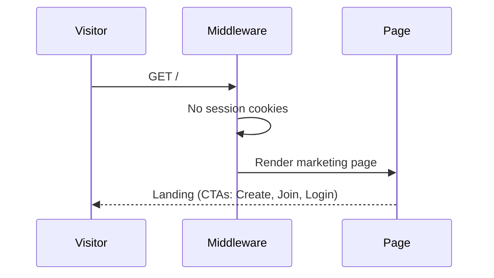
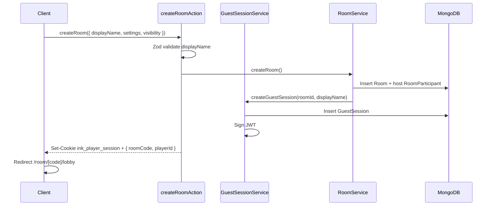
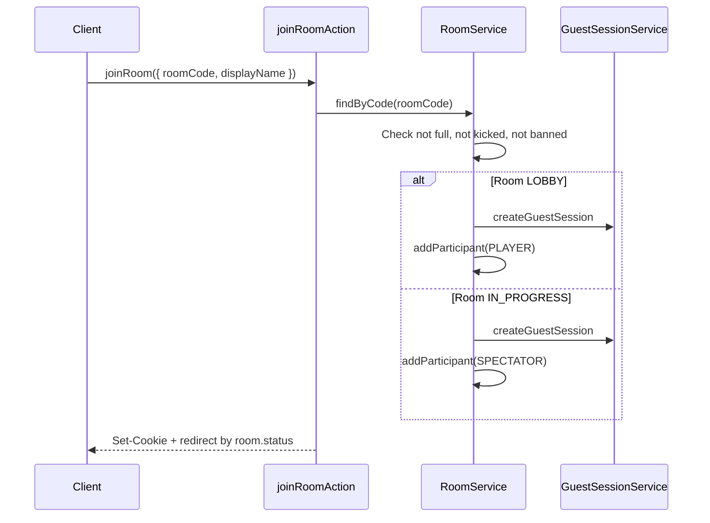
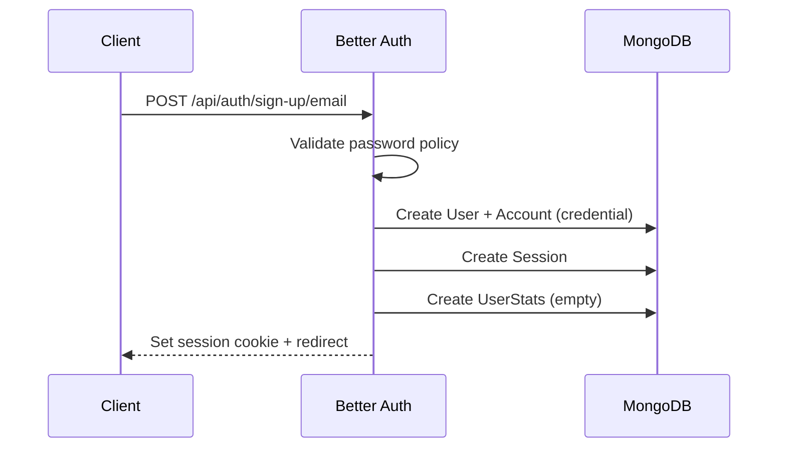
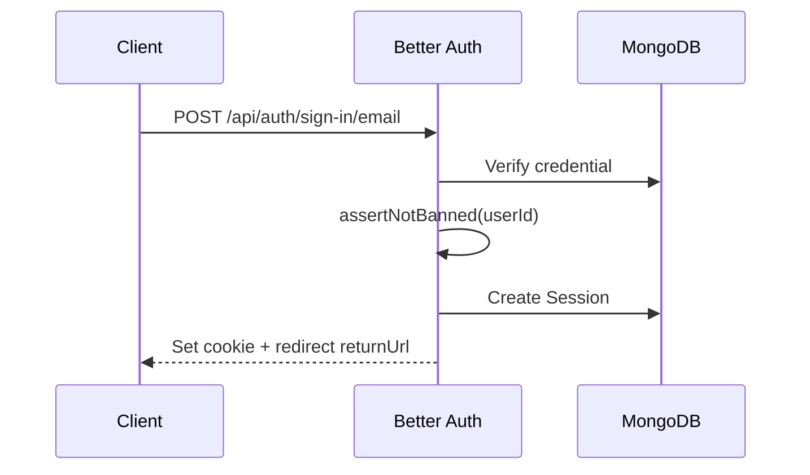
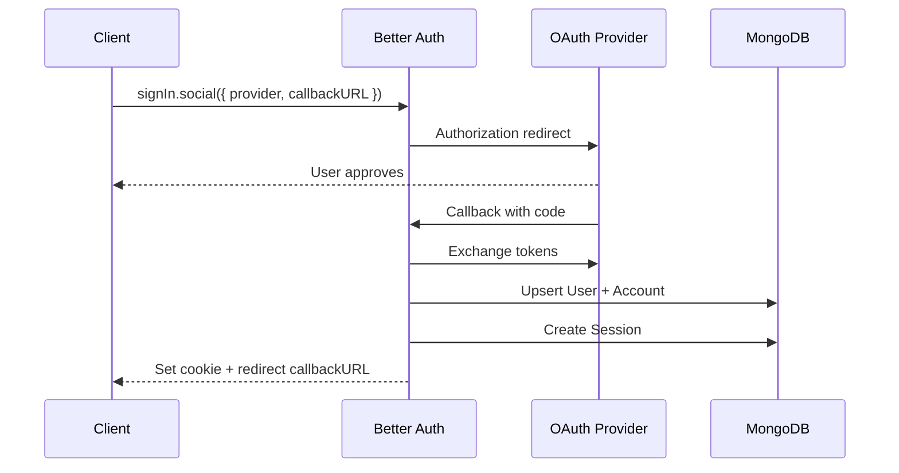
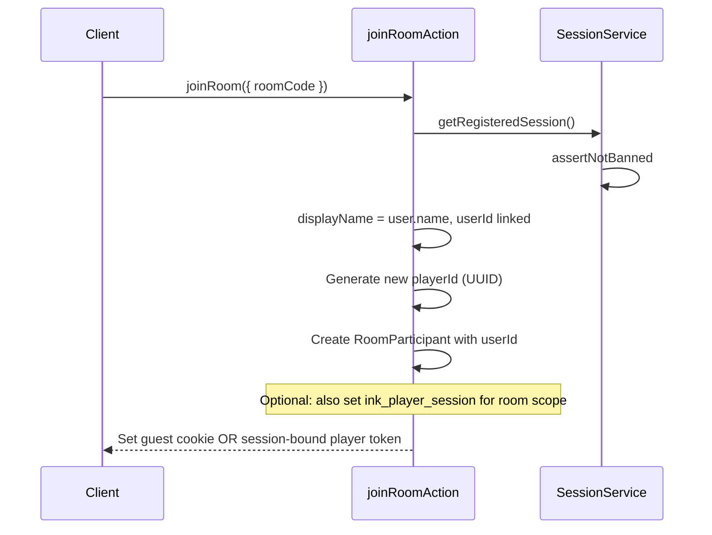
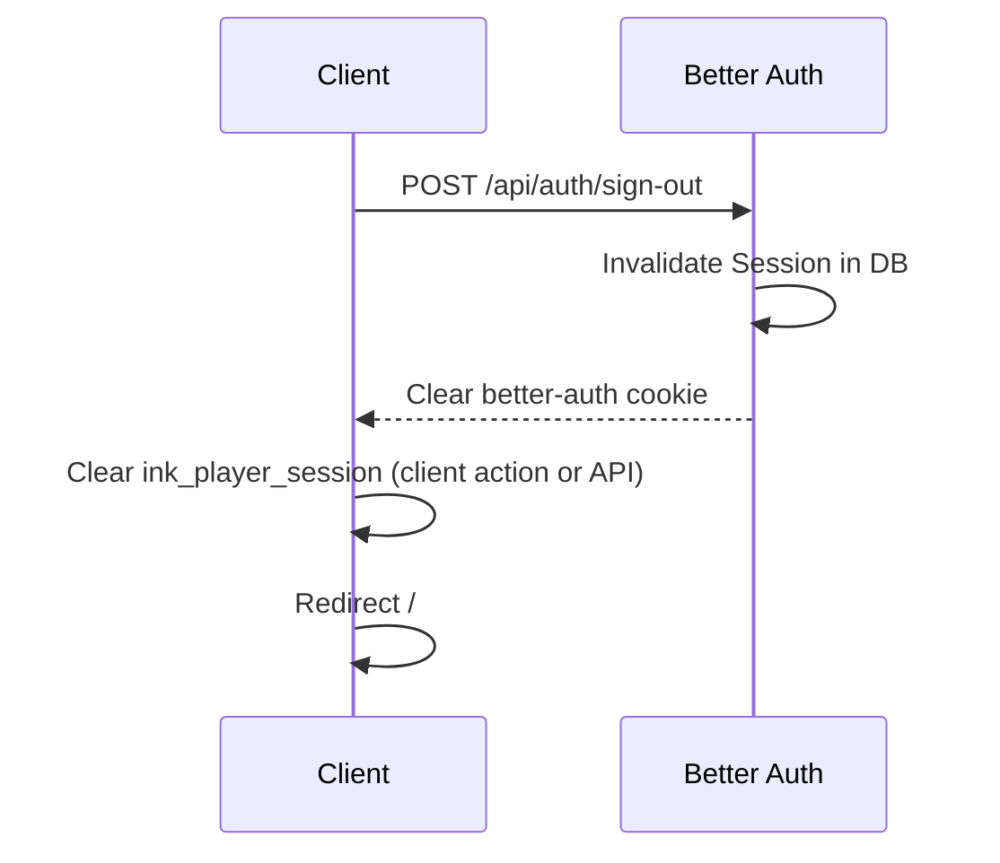
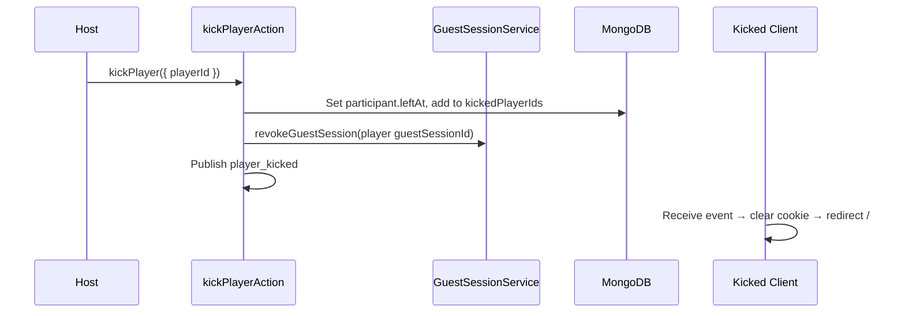

# Phase 4 — Document 2: Authentication Flows

## Overview

Complete flow specifications for every authentication path. Each flow lists **trigger**, **steps**, **cookies set**, **DB writes**, and **error exits**.

---

## Flow A: Anonymous Browsing

**Trigger:** Visitor opens `/`, `/browse`, `/legal/*`



| Capability | Allowed |
|------------|---------|
| View landing, legal | ✓ |
| Browse public rooms list | ✓ (read-only) |
| Create/join room | ✗ — prompts name or login |
| Profile, admin | ✗ |

---

## Flow B: Guest — Create Room & Enter Lobby

**Trigger:** Anonymous user clicks Create Room, enters display name



**DB writes (atomic transaction):**

1. `Room` — status `LOBBY`, host = new `playerId`
2. `RoomParticipant` — role `HOST`, `isReady: false`
3. `GuestSession` — `expiresAt = now + 24h`

**Cookie:** `ink_player_session` — HttpOnly, 24h max-age

**Errors:**

| Error | Cause |
|-------|-------|
| `VALIDATION_ERROR` | Invalid display name |
| `RATE_LIMITED` | Too many rooms from IP |
| `BANNED` | IP/user blocked |

---

## Flow C: Guest — Join Room by Code

**Trigger:** User submits code + display name on `/join`



**Kick blocklist check:**

```typescript
if (room.kickedPlayerIds.includes(existingPlayerId)) {
  throw new ForbiddenError('KICKED');
}
// New guest always gets new playerId — blocklist is by playerId from prior session
// Store kicked playerId at kick time
```

---

## Flow D: Registered — Email Sign Up

**Trigger:** User submits register form



**Password policy:**

- Min 8 characters
- At least 1 uppercase, 1 number
- Validated in Zod + Better Auth

**Post-signup:**

- `UserStats` initialized to zeros
- Optional email verification (P1 — send verification, restrict profile until verified)

---

## Flow E: Registered — Email Login

**Trigger:** User submits login form



**returnUrl handling:**

- Validate `returnUrl` is same-origin path (prevent open redirect)
- Default `/` if missing or invalid

---

## Flow F: Registered — OAuth (Google / GitHub)

**Trigger:** User clicks OAuth button



**Account linking:** If email already exists with different provider → Better Auth linking rules apply (link or error with message).

---

## Flow G: Registered — Join Room (Logged In)

**Trigger:** Logged-in user joins room without re-entering name



**Design decision:** Registered users in rooms **also receive `ink_player_session`** scoped to the room. This unifies `getAuthContext()` for game actions — one cookie for all in-room operations.

**JWT claims for registered in-room:**

```typescript
{
  sub: guestSessionId;     // Still create GuestSession OR use PlayerSession model
  userId: string;          // Additional claim
  playerId: string;
  roomId: string;
  type: 'registered';
}
```

*Alternative (chosen):* Create `GuestSession` record for all in-room players (registered or not) — links `userId` on RoomParticipant. Simplifies one code path.

---

## Flow H: Logout

**Trigger:** User clicks Log out



**In-room logout:** Warn dialog — "Leaving will forfeit your seat."

Clear both cookies always on logout.

---

## Flow I: Guest → Registered Conversion (Post-MVP P2)

**Trigger:** Guest clicks "Save progress" or signs up after playing

```
1. Guest has active ink_player_session
2. User completes registration
3. Server links RoomParticipant.userId to new User.id
4. Backfill GameHistory for completed games in session (if any)
5. Clear guest-only limitations
```

MVP: Registration does not retroactively link current guest session unless explicitly designed — user gets new account, guest session continues independently.

---

## Flow J: Host Transfer on Leave

**Trigger:** Host leaves lobby or disconnects beyond grace

```
1. hostPlayerId updated to next participant (joinedAt order)
2. RoomParticipant.role updated: old HOST → PLAYER, new → HOST
3. Ably event host_changed
4. If host was guest, guest session of new host unchanged
```

Auth implication: host permissions follow `Room.hostPlayerId`, not cookie — re-validated server-side.

---

## Flow K: Kick Player (Auth Invalidation)

**Trigger:** Host kicks player



Kicked player's JWT invalidated by deleting `GuestSession` document — verify fails on next request.

---

## Flow L: Admin Impersonation

**Not in MVP.** Admin uses moderation tools without joining as player.

---

## Anonymous vs Guest vs Registered Summary

| Action | Anonymous | Guest | Registered |
|--------|-----------|-------|------------|
| View landing | ✓ | ✓ | ✓ |
| Create room | name required | ✓ | ✓ (uses account name) |
| Join room | name required | ✓ | ✓ |
| Profile / history | ✗ | ✗ | ✓ |
| Persist stats | ✗ | ✗ | ✓ |
| OAuth | ✗ | ✗ | ✓ |
| Reconnect to room | ✗ | ✓ (24h) | ✓ (30d + room session) |
| Admin | ✗ | ✗ | ✓ (if role ADMIN) |

---

## Server Action Auth Pattern

Every action follows this template:

```typescript
'use server';

export async function exampleAction(input: ExampleDto): Promise<ActionResult<ExampleResponse>> {
  const correlationId = await getCorrelationId();
  try {
    const parsed = exampleSchema.parse(input);
    const ctx = await requirePlayerSession(parsed.roomId);
    authorize(ctx, 'game:submit');
    await assertNotBanned(ctx.type === 'registered' ? ctx.userId : undefined);

    const result = await exampleService.execute(ctx, parsed);
    return { success: true, data: result };
  } catch (error) {
    return handleActionError(error, correlationId);
  }
}
```

---

## Client UX States

| State | UI |
|-------|-----|
| Anonymous on landing | Login button + guest CTAs |
| Guest in lobby | Display name badge, no avatar upload (MVP) |
| Registered | Avatar + name from profile |
| Session loading | Skeleton header |
| Session expired | Toast + redirect to join with code pre-filled |
| Banned | Full-page message, support link |

---

## Related Documents

- Architecture: [01-authentication-architecture.md](./01-authentication-architecture.md)
- Recovery: [03-session-recovery.md](./03-session-recovery.md)
- User stories: [../phase-0/04-user-stories.md](../phase-0/04-user-stories.md) (Epic 2)
