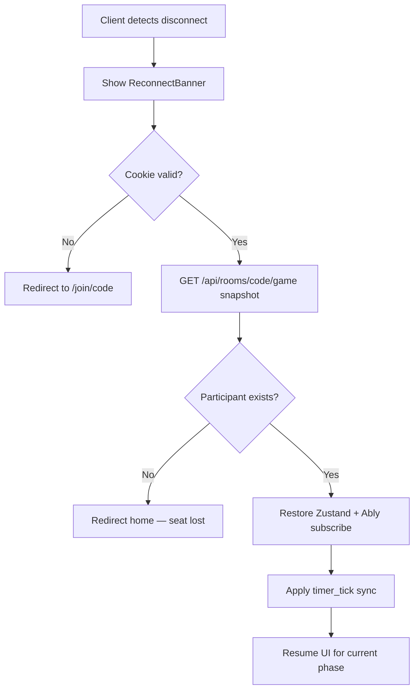
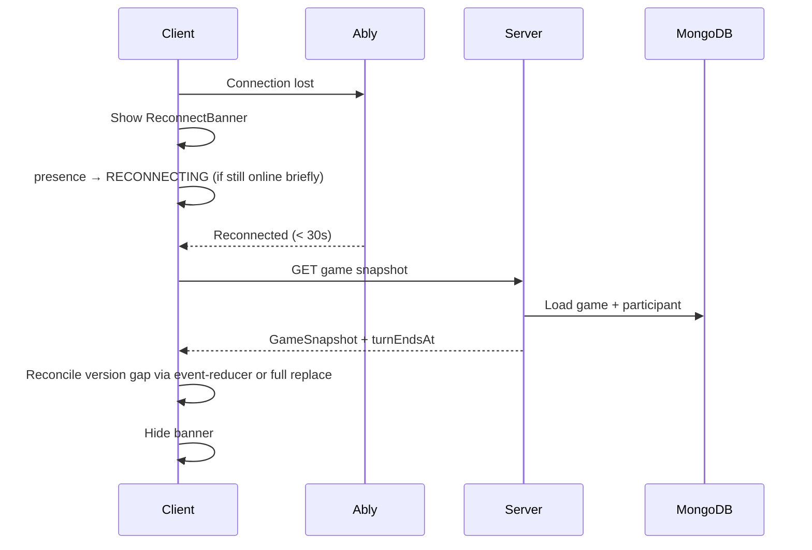

# Phase 4 — Document 3: Session Recovery & Reconnect

## Overview

Party games fail if disconnects lose player seats. InkEcho implements **layered recovery**: JWT cookie persistence, DB session validation, participant slot holding, presence grace periods, and full state snapshot on reconnect.

---

## Recovery Scenarios Matrix

| Scenario | Expected outcome |
|----------|------------------|
| Page refresh in lobby | Same seat, ready state preserved |
| Page refresh mid-turn | Resume turn with corrected timer |
| Network blip (< 5s) | Ably reconnect; no UI disruption |
| Disconnect 5–30s | `RECONNECTING` badge; turn held |
| Disconnect > 30s mid-turn | Turn skipped/auto-submitted; game continues |
| Guest cookie expired | Prompt re-join with name; old seat released |
| Registered session expired | Redirect login; room session lost |
| Kicked | Cookie revoked; cannot rejoin same room |
| Room closed | Clear cookie; redirect home with message |
| Browser crash | Same as refresh if cookie valid |
| New device | Must re-join (no cross-device session, MVP) |

---

## Reconnect Architecture



---

## Flow R1: Page Refresh (Happy Path)

**Trigger:** F5 or navigation within same room

```
1. Browser sends ink_player_session cookie
2. Room layout Server Component:
   a. verifyGuestSession(cookie)
   b. Load GuestSession from DB — check not expired
   c. Load RoomParticipant — check leftAt is null
   d. Load Room by code — verify status
3. Redirect to correct phase route (lobby/game/reveal)
4. Client mounts RealtimeProvider → Ably connect
5. TanStack Query fetches room/game snapshot
6. Zustand hydrates from snapshot
```

No re-login required. **Target: < 2s to restored UI.**

---

## Flow R2: Network Disconnect During Game

**Trigger:** Ably connection lost



**Server-side presence (optional enhancement):**

On Ably `leave` event, server sets `RoomParticipant.connectionStatus = RECONNECTING` and starts grace timer. On `enter`, set `ONLINE`.

---

## Flow R3: Disconnect Beyond Grace Period

**Trigger:** No heartbeat for > `DISCONNECT_GRACE_MS` (30s default)

```
1. Game service detects active player offline (cron or turn timer job)
2. If current turn belongs to disconnected player:
   a. Mark turn skipped: { skipped: true, autoSubmitted: false }
   b. Advance state machine
   c. Publish turn_skipped + turn_changed
3. Other clients continue game
4. Late reconnecting player:
   a. Snapshot shows they are not activePlayerId
   b. UI = waiting view (or spectator if seat released)
```

**Seat release policy (MVP):** Player keeps seat in lobby/participant list but loses active turn. Not removed from game unless host kicks.

---

## Flow R4: Guest Session Expiry

**Trigger:** `GuestSession.expiresAt < now` or TTL index deleted document

```
1. verifyGuestSession fails
2. Server Action returns 401 UNAUTHORIZED
3. Client clears invalid cookie
4. Redirect /join/[code]?expired=1
5. UI: "Session expired — re-enter your name to rejoin"
6. New GuestSession + new playerId on rejoin
```

**Prior player slot:** If game in progress, old `playerId` marked `OFFLINE` — host may kick. Rejoin with new name creates **new participant** (spectator if mid-game).

---

## Flow R5: Registered Session Expiry (Out of Room)

**Trigger:** Better Auth session expired while browsing `/profile`

```
1. Middleware redirects to /auth/login?returnUrl=/profile
2. After login, return to profile
3. No room impact
```

---

## Flow R6: Registered Session Expiry (In Room)

**Trigger:** Better Auth expired but `ink_player_session` still valid

```
1. In-room actions use ink_player_session — game continues
2. Profile actions fail until re-login
3. Optional banner: "Sign in to save stats from this game"
```

**At game end:** GameHistory only written for participants with `userId` linked — guest-only participants skip history.

---

## Flow R7: Version Gap on Reconnect

**Trigger:** Client version << server version after disconnect

```
1. Client local version = 41, server = 45
2. event-reducer detects gap > 1
3. Client calls GET /api/rooms/[code]/game
4. Replace entire Zustand store with snapshot
5. Do not replay missed events individually
```

Prefer **full snapshot** over event replay for MVP simplicity.

---

## Flow R8: Reconnect During Reveal

**Trigger:** User reloads during REVEAL phase

```
1. Load game snapshot with revealChainIndex, revealStepIndex
2. Reveal UI resumes at stored step
3. Ably reveal_chain_step events still broadcast for sync
4. Client compares step index — jump forward if behind
```

Fields from Phase 3 schema: `Game.revealChainIndex`, `Game.revealStepIndex`.

---

## Flow R9: Room Closed While Away

**Trigger:** Idle timeout cron closes room

```
1. Client receives room_closed Ably event OR polling detects CLOSED
2. Clear ink_player_session
3. Toast: "Room closed due to inactivity"
4. Redirect /
```

---

## Session Heartbeat

Keep `GuestSession.lastSeenAt` fresh for ops/debug:

| Mechanism | Interval |
|-----------|----------|
| Ably presence update | On connect |
| Lightweight POST `/api/rooms/[code]/heartbeat` | Every 60s in room (optional P1) |
| Any authenticated Server Action | Updates lastSeenAt as side effect |

Not required for MVP game logic — grace period uses Ably presence + turn timer.

---

## Cookie Refresh

| Cookie | Refresh strategy |
|--------|------------------|
| `ink_player_session` | Re-issued on successful join with new `exp` — sliding 24h window optional (P1) |
| Better Auth session | Auto-refresh via `session.updateAge` on activity |

**Sliding guest TTL (P1):** Each action extends `expiresAt` by 24h from now, capped at 7 days max.

---

## State Recovery Payload

`GET /api/rooms/[code]/game` returns filtered snapshot:

```typescript
interface ReconnectSnapshot {
  room: {
    code: string;
    status: RoomStatus;
    hostPlayerId: string;
  };
  participant: {
    playerId: string;
    role: ParticipantRole;
    displayName: string;
  };
  game: GameSnapshot | null;  // null if LOBBY
  serverTime: string;         // ISO — for timer sync
}
```

`GameSnapshot` filtered by `domain/game/visibility-filter.ts` — same rules as active play (hidden content for non-active players).

---

## Client Implementation Checklist (M3/M4)

- [ ] `ReconnectBanner` component with retry count
- [ ] Ably `connected`, `disconnected`, `failed` handlers
- [ ] Exponential backoff: 1s, 2s, 4s, 8s, max 30s
- [ ] On reconnect: `queryClient.invalidateQueries(['room', code])`
- [ ] Zustand `replaceState(snapshot)` method — no merge on large gap
- [ ] Tab title alert on your turn after reconnect
- [ ] Clear cookies on `player_kicked` and `room_closed` events

---

## Security During Recovery

| Risk | Mitigation |
|------|------------|
| Stolen guest JWT | Short TTL; HttpOnly; room-scoped; revoke on kick |
| Replay old JWT after kick | GuestSession deleted — verify fails |
| Session fixation | New token (jti) on each join; new playerId |
| Cross-room JWT reuse | Verify JWT.roomId === requested roomId |
| Rejoin after ban | assertNotBanned on registered; kick list for room |

**JWT room binding check (every request):**

```typescript
if (payload.roomId !== requestedRoomId) {
  throw new ForbiddenError('SESSION_ROOM_MISMATCH');
}
```

---

## Testing Scenarios (Document 19 alignment)

| Test ID | Scenario |
|---------|----------|
| AUTH-R1 | Refresh in lobby preserves ready state |
| AUTH-R2 | Refresh on describe turn preserves text input (localStorage draft) |
| AUTH-R3 | Ably disconnect 10s → auto reconnect → same turn |
| AUTH-R4 | Disconnect 35s on turn → turn skipped |
| AUTH-R5 | Expired guest cookie → rejoin flow |
| AUTH-R6 | Kicked player cannot rejoin with same cookie |
| AUTH-R7 | Version gap → full snapshot reload |

---

## Related Documents

- Architecture: [01-authentication-architecture.md](./01-authentication-architecture.md)
- Flows: [02-authentication-flows.md](./02-authentication-flows.md)
- Realtime (Phase 5): reconnect integrates with Ably design
- Game state machine: [../phase-0/11-game-state-machine.md](../phase-0/11-game-state-machine.md)

## Approval Gate

Phase 5 (realtime architecture — Ably channels, presence, sync) begins after Phase 4 approval.
