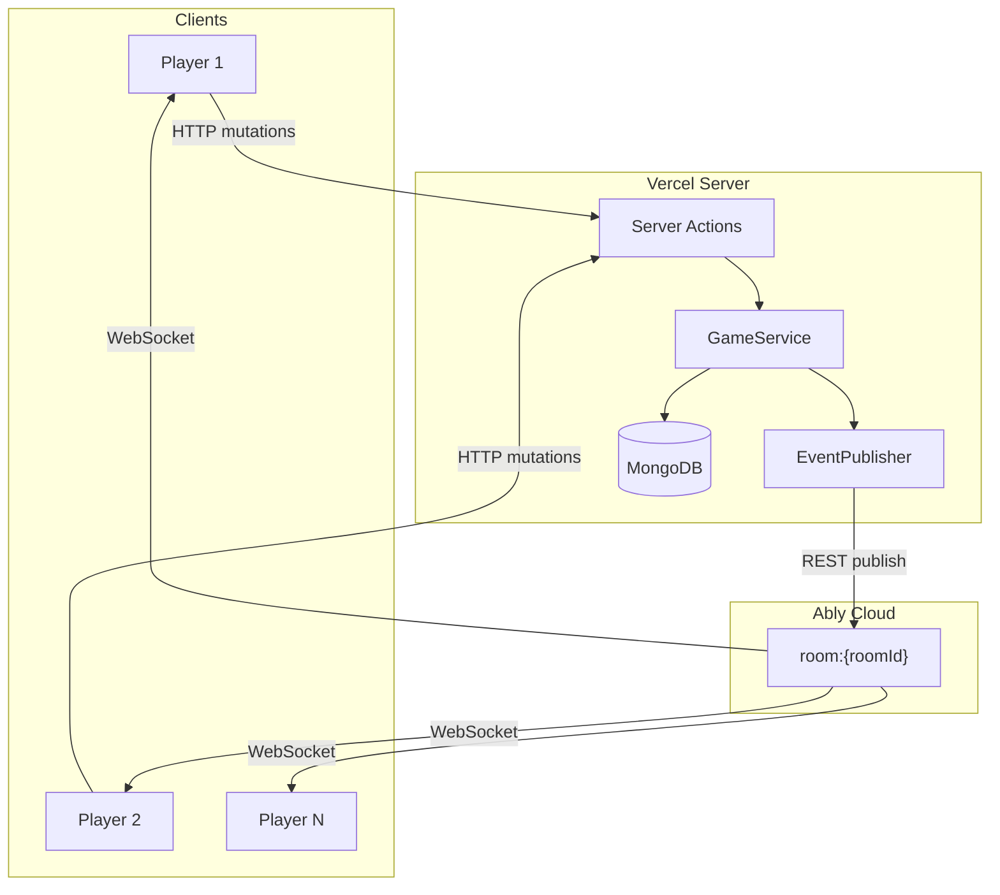
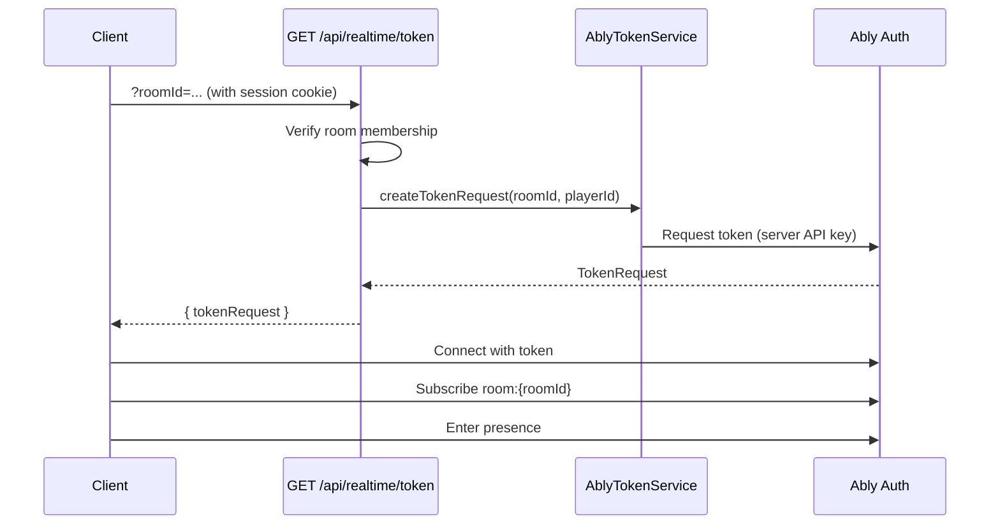
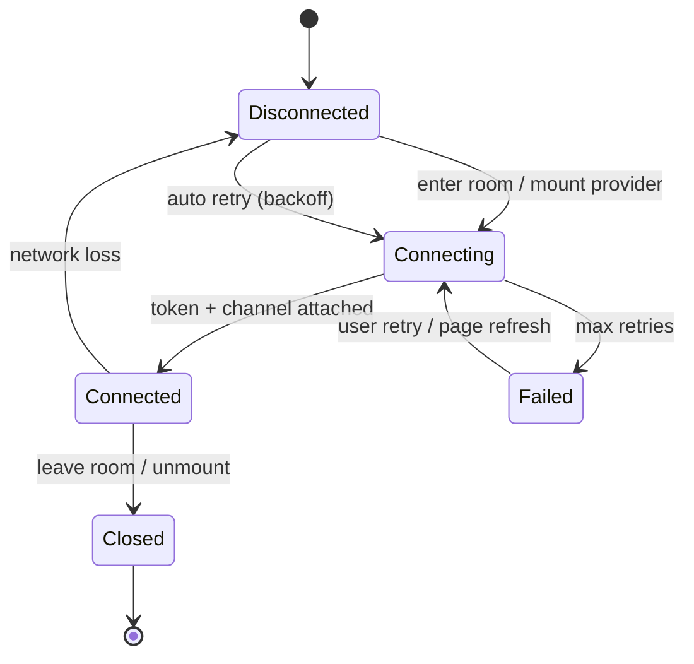
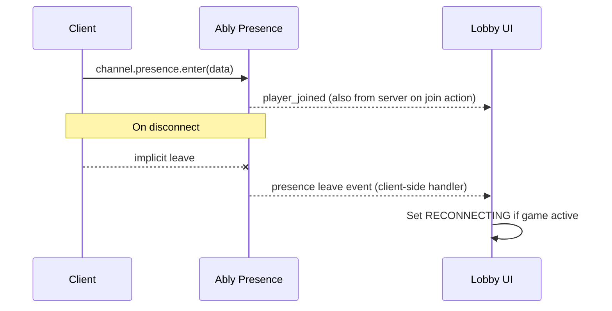

# Phase 5 — Document 1: Realtime Architecture Overview

## Overview

InkEcho uses **Ably** as the managed realtime layer. The architecture is **server-authoritative**: all state mutations persist to MongoDB first, then the server publishes events to Ably. Clients never publish game events directly.

**Implementation homes (M4):**

```
infrastructure/realtime/     Server publish, token service
features/realtime/           Client hooks, event reducer, provider
features/game/stores/        Zustand game state (event target)
shared/constants/            Event name constants
```

**Related Phase 0 doc:** [Document 10 — Realtime Events](../phase-0/10-realtime-events.md) (full event catalog)

---

## Design Principles

| Principle | Implementation |
|-----------|----------------|
| **Server is source of truth** | DB write → then Ably publish |
| **Room isolation** | One Ably channel per room — no global broadcasts |
| **Typed events** | Envelope + name constants; Zod validate on client |
| **Version ordering** | Monotonic `version` on every mutation |
| **Least privilege** | Clients subscribe only; server publishes |
| **Idempotent handling** | Duplicate events ignored via version check |
| **Fail gracefully** | Ably down → banner + snapshot polling fallback |

---

## System Diagram



**Critical path:** Mutation latency = DB write + Ably REST publish (~100–400ms P95).

---

## Ably Channel Strategy

### Channel Naming

| Channel | Pattern | Example |
|---------|---------|---------|
| Room channel | `room:{roomId}` | `room:65f1a2b3c4d5e6f7a8b9c0d1` |
| User channel (P2) | `user:{userId}` | Personal notifications |

**Use MongoDB ObjectId in channel name** — not room code (codes are guessable; ObjectIds are not).

Constants file: `features/realtime/lib/channel-names.ts`

```typescript
export function getRoomChannelName(roomId: string): string {
  return `room:${roomId}`;
}
```

### Single Channel per Room

All lobby, game, and reveal events publish to the **same room channel**. Event name distinguishes phase — no channel switching on game start.

**Benefits:**
- One Ably subscription lifecycle per room visit
- Simpler token capabilities
- Presence stays on one channel

**Tradeoff:** Spectators receive same events as players (filtered client-side for hidden content).

---

## Ably Capabilities & Token Auth

### Token Request Flow



### Capability Matrix

**Client token (subscribe-only):**

```json
{
  "room:{roomId}": ["subscribe", "presence"]
}
```

**Server (root API key — never exposed to client):**

```json
{
  "room:*": ["publish"]
}
```

| Capability | Client | Server |
|------------|--------|--------|
| `subscribe` | ✓ | — |
| `presence` | ✓ | — |
| `publish` | ✗ | ✓ |
| `history` | ✗ (MVP) | optional debug |

### Token Configuration

| Setting | Value | Env var |
|---------|-------|---------|
| TTL | 3600s (1 hour) | `ABLY_TOKEN_TTL_SECONDS` |
| Auto-refresh | 55 min (client) | — |
| Client ID | `playerId` | Set on token for presence |

---

## Connection Lifecycle (Client)



### Client Connection Manager

File: `features/realtime/hooks/use-ably-room.ts`

| State | UI |
|-------|-----|
| `connecting` | Optional subtle indicator |
| `connected` | Normal operation |
| `disconnected` | `ReconnectBanner` after 3s |
| `failed` | Banner + manual refresh CTA |
| `suspended` | Ably suspended — same as disconnected |

**Retry backoff:** 1s → 2s → 4s → 8s → 16s → 30s (cap), jitter ±20%

---

## Event Envelope (Canonical)

All server-published messages use this structure:

```typescript
interface RealtimeEnvelope<T = unknown> {
  name: RealtimeEventName;     // snake_case constant
  payload: T;
  version: number;             // Room or Game version post-mutation
  scope: 'room' | 'game';      // Which version counter applies
  timestamp: string;           // ISO 8601 server time
  correlationId: string;
}
```

### Version Scopes

| Scope | `version` refers to | Used for |
|-------|---------------------|----------|
| `room` | Room document version (add field in M4) OR lobby events use game version 0 | Lobby events |
| `game` | `Game.version` | Turn/game events |

**Phase 5 addition:** Add `Room.version Int @default(1)` to schema in M4 for lobby-only mutations independent of game. *Document as recommended schema addition.*

For MVP without Room.version: lobby events use `version: 0` and clients don't version-check lobby — full snapshot via TanStack Query invalidation.

---

## Server Publish Pipeline

File: `infrastructure/realtime/event-publisher.ts`

```
1. Domain service completes DB transaction
2. Build RealtimeEnvelope from event type + DTO
3. eventPublisher.publish(roomId, envelope)
4. Ably REST: channel.publish(name, envelope)
5. Log at info: action + correlationId
6. On failure: retry 3x exponential → log error → return success to client anyway (DB already committed)
```

**Publish-after-persist:** Client may receive HTTP 200 before Ably event — optimistic UI handles this; other clients wait for event.

### Publish Failure Handling

| Scenario | Behavior |
|----------|----------|
| Ably REST fails after DB commit | Log critical; clients poll snapshot on next action |
| Retry succeeds | Normal |
| All retries fail | Sentry alert; `error` event not sent (clients use stale detection) |

Clients detect staleness: no event for 10s during active turn → fetch snapshot.

---

## Client Subscription Pipeline

File: `features/realtime/hooks/use-realtime-sync.ts`

```
1. Subscribe to room:{roomId}
2. On message: parse envelope (Zod)
3. eventReducer(currentState, envelope) → newState
4. If version gap > 1: fetch full snapshot instead
5. Update Zustand game-store
6. Invalidate TanStack Query keys as needed
```

File: `features/realtime/lib/event-reducer.ts`

Pure function — testable without Ably.

---

## Presence Design

### Purpose

| Use | How |
|-----|-----|
| Show online/reconnecting/offline badges | Lobby player cards |
| Detect disconnect grace | Server webhook or client-reported (MVP: timer-based skip) |
| Spectator count | Count presence members with role SPECTATOR |

### Presence Data Schema

```typescript
interface PresenceData {
  playerId: string;
  displayName: string;
  role: 'HOST' | 'PLAYER' | 'SPECTATOR';
  connectionStatus: 'ONLINE' | 'RECONNECTING';
}
```

### Presence Lifecycle



**Server-authoritative join/leave** still comes from Server Actions (`player_joined`, `player_left` events). Ably presence is **supplementary** for connection status dots — not sole source of participant list.

### Presence Sync on Connect

```typescript
channel.presence.subscribe('enter', handleEnter);
channel.presence.subscribe('leave', handleLeave);
channel.presence.subscribe('update', handleUpdate);
const members = await channel.presence.get();
// Reconcile with server participant list — server wins on conflict
```

---

## RealtimeProvider Component

File: `features/realtime/providers/RealtimeProvider.tsx`

```typescript
interface RealtimeProviderProps {
  roomId: string;
  roomCode: string;
  playerId: string;
  children: React.ReactNode;
}
```

**Mounted in:** `app/(game)/room/[code]/layout.tsx` (client wrapper)

**Responsibilities:**
- Fetch Ably token on mount + refresh before expiry
- Connect single Ably Realtime instance (singleton per tab)
- Subscribe room channel + presence
- Wire `use-realtime-sync` to game store
- Cleanup on unmount: unsubscribe, close connection

---

## Event Categories → Store Slices

| Category | Events | Store / Query |
|----------|--------|---------------|
| Lobby | `player_joined`, `player_left`, `player_ready_changed`, `room_settings_updated`, `host_changed` | TanStack Query `['room', code]` + lobby local state |
| Game | `game_started`, `turn_started`, `turn_changed`, `description_submitted`, `drawing_submitted`, `timer_tick`, `timer_expired` | Zustand `game-store` |
| Pause | `game_paused`, `game_resumed` | Zustand |
| Reveal | `reveal_started`, `reveal_chain_step`, `reveal_completed` | Zustand reveal slice |
| Lifecycle | `room_closed`, `player_kicked`, `returned_to_lobby` | Router + toast |

---

## Optimistic UI Integration

When local player mutates:

```
1. Client: optimistic update to Zustand (optional for submit)
2. Client: await Server Action response
3. On success: reconcile with response DTO (version)
4. On 409 VERSION_CONFLICT: replace state from response snapshot
5. Ably event arrives: ignore if version <= localVersion
```

Other players: event-only updates (no optimistic).

---

## Fallback When Ably Unavailable

| Mode | Trigger | Behavior |
|------|---------|----------|
| **Normal** | Ably connected | Event-driven updates |
| **Degraded** | Disconnected > 5s | Banner + continue showing last known state |
| **Polling fallback** | Disconnected > 15s | Poll `GET /api/rooms/[code]/game` every 5s |
| **Hard fail** | Room action needs sync | Disable submit until reconnected |

Polling stops when Ably reconnects.

---

## Monitoring & Metrics

| Metric | Source | Alert |
|--------|--------|-------|
| Publish latency | Server logs | P95 > 500ms |
| Ably connection failures | Sentry + client breadcrumb | > 5% sessions |
| Version conflict rate | Server logs | > 2% of submits |
| Event delivery gap | Client RUM | > 2s during turn |

---

## Environment & Secrets

| Variable | Purpose |
|----------|---------|
| `ABLY_API_KEY` | Server REST publish + token generation |
| `ABLY_TOKEN_TTL_SECONDS` | Token lifetime |
| Never expose root key to client | Token auth only |

---

## Related Documents

- Sync & conflicts: [02-synchronization-and-conflict-resolution.md](./02-synchronization-and-conflict-resolution.md)
- Disconnect & offline: [03-disconnect-reconnect-offline.md](./03-disconnect-reconnect-offline.md)
- Events catalog: [../phase-0/10-realtime-events.md](../phase-0/10-realtime-events.md)
- Auth token gate: [../phase-4/01-authentication-architecture.md](../phase-4/01-authentication-architecture.md)

## Approval Gate

Phase 6 (backend architecture) begins after Phase 5 approval.
