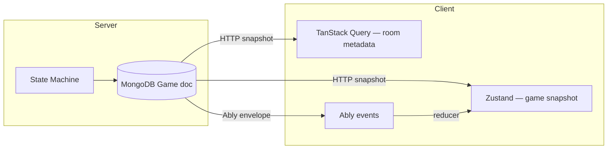
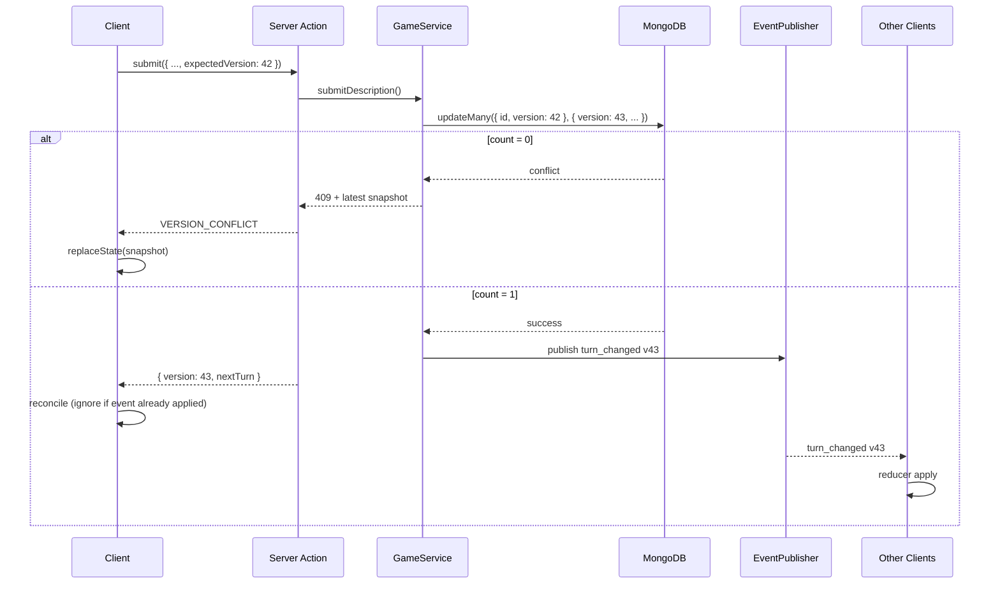

# Phase 5 — Document 2: Synchronization & Conflict Resolution

## Overview

Game synchronization keeps all clients **eventually consistent** with the server state machine. This document defines the sync protocol, version model, event reducer rules, and conflict handling.

**Golden rule:** If client and server disagree, **server wins**.

---

## State Layers



| Layer | Data | Update trigger |
|-------|------|----------------|
| MongoDB | Full authoritative game | Server Actions |
| TanStack Query | Room, participants, settings | Events + invalidation |
| Zustand | Active game snapshot, timer display | Events + HTTP reconcile |
| Local draft | Canvas strokes, describe textarea | localStorage only — not synced |

---

## Version Model

### Game.version

- Starts at `1` on `game_started`
- Increments by `1` on every successful game mutation
- Included in every `scope: 'game'` Ably envelope
- Required on mutating requests: `expectedVersion`

### Client Version Tracking

```typescript
interface GameStoreState {
  gameId: string | null;
  version: number;
  // ... game fields
  lastEventTimestamp: string | null;
}
```

### Version Decision Table

| Condition | Action |
|-----------|--------|
| `event.version === local.version + 1` | Apply event normally |
| `event.version === local.version` | Ignore (duplicate) |
| `event.version < local.version` | Ignore (stale) |
| `event.version > local.version + 1` | **Snapshot resync** — gap detected |
| HTTP response `version > local.version` | Replace local from response |

---

## Mutation Protocol



### Idempotent Submit

If turn already `SUBMITTED` for same player:

```typescript
if (currentTurn.submittedAt && currentTurn.playerId === ctx.playerId) {
  return ok({ version: game.version, alreadySubmitted: true });
}
```

Prevents double-submit errors on retry — critical for flaky mobile networks.

---

## Optimistic Locking (Repository)

```typescript
async function updateGame(
  gameId: string,
  expectedVersion: number,
  data: Prisma.GameUpdateInput,
): Promise<Result<Game, AppError>> {
  const result = await prisma.game.updateMany({
    where: { id: gameId, version: expectedVersion },
    data: { ...data, version: { increment: 1 } },
  });

  if (result.count === 0) {
    const latest = await prisma.game.findUnique({ where: { id: gameId } });
    return err(new ConflictError('VERSION_CONFLICT', { snapshot: mapGame(latest) }));
  }

  return ok(await prisma.game.findUnique({ where: { id: gameId } }));
}
```

---

## Event Reducer Architecture

File: `features/realtime/lib/event-reducer.ts`

```typescript
export function reduceGameEvent(
  state: GameStoreState,
  envelope: RealtimeEnvelope,
): ReduceResult {
  // Returns { state, needsSnapshot: boolean }
}
```

### Reducer Rules by Event

| Event | Reducer behavior |
|-------|------------------|
| `game_started` | Replace game slice; set version; navigate to game |
| `turn_started` | Update currentTurn, timer, phase UI flags |
| `turn_changed` | Advance turn indices; clear prior phase local state |
| `description_submitted` | Metadata only — no text leak |
| `drawing_submitted` | Metadata only — no URL leak until reveal |
| `turn_skipped` | Advance same as turn_changed |
| `timer_tick` | Update `turnEndsAt`, `serverTimeOffset` |
| `timer_expired` | Trigger waiting UI transition |
| `game_paused` | Set paused flag; freeze timer display |
| `game_resumed` | Update `turnEndsAt` from payload |
| `reveal_started` | Switch to reveal mode; reset step indices |
| `reveal_chain_step` | Append step to reveal playback queue |
| `reveal_completed` | Set vote results |
| `returned_to_lobby` | Clear game store; invalidate room query |
| `player_kicked` | If self → exit; else update participant list |
| `room_closed` | Clear all; redirect |

### Hidden Content Filter

Reducer **never** applies secret content from events. Full content comes from HTTP snapshot filtered by `visibility-filter.ts` for active player only.

Events carry metadata; snapshot carries secrets:

| Data | Via event | Via snapshot |
|------|-----------|--------------|
| Active player's prompt text | ✓ (turn_started to active player only — server publishes differentiated payloads P1) | ✓ |
| Other player's input | ✗ | ✗ |
| Drawing URLs before reveal | ✗ | ✗ |
| Timer | ✓ | ✓ |

**MVP simplification:** Server publishes `turn_started` with `promptText` only to active player via **HTTP response**, not Ably broadcast. Ably `turn_started` for others excludes `promptText`. Active player already has text from submit response chain.

---

## Timer Synchronization

### Server-Authoritative Clock

```typescript
interface TimerSync {
  turnEndsAt: string;       // ISO epoch from server
  serverTime: string;       // Server now
  clientOffsetMs: number;   // serverTime - Date.now() at receive
}
```

**Client countdown:**

```typescript
function getRemainingMs(state: TimerSync): number {
  const now = Date.now() + state.clientOffsetMs;
  return Math.max(0, new Date(state.turnEndsAt).getTime() - now);
}
```

### timer_tick Event

Broadcast every **10 seconds** during active turn (server cron or post-mutation scheduler):

```json
{
  "name": "timer_tick",
  "payload": {
    "turnEndsAt": "...",
    "serverTime": "...",
    "remainingSeconds": 45
  },
  "version": 43,
  "scope": "game"
}
```

Corrects client drift. Primary display uses local interpolation between ticks.

### Pause Handling

On `game_paused`:

```json
{ "pausedAt": "...", "remainingSeconds": 45 }
```

Store `pauseRemainingMs` — stop countdown.

On `game_resumed`:

```json
{ "turnEndsAt": "...", "remainingSeconds": 45 }
```

Recalculate offset; resume countdown.

---

## Reveal Synchronization

Reveal requires **lockstep playback** across clients (±500ms).

### Server as Reveal Orchestrator

```
1. Game transitions to REVEAL — publish reveal_started
2. Server sets revealChainIndex=0, revealStepIndex=0 in DB
3. For each step:
   a. Publish reveal_chain_step with full content (all players see)
   b. Wait REVEAL_STEP_DURATION_MS (server-side scheduler)
   c. Increment revealStepIndex in DB
   d. Repeat until chain complete
   e. Next chain or reveal_completed
```

**Client role:** Render step on event — do not auto-advance independently.

### Reveal Reconnect

Client reads `revealChainIndex`, `revealStepIndex` from snapshot, then:

```
1. Catch up to current step via queued events OR
2. Fetch snapshot + request reveal state endpoint (P1)
```

MVP: Full snapshot includes reveal indices; client jumps UI to current step without replaying prior animations.

---

## Conflict Scenarios

### Scenario 1: Simultaneous Submit (Same Turn)

| Player | Action |
|--------|--------|
| A | Submit at T+0ms, version 42 |
| B | Malicious duplicate request | Blocked — not active player |

Only one player per turn — no true dual-submit conflict.

### Scenario 2: Submit vs Timer Expiry

| Race | Resolution |
|------|------------|
| Submit + timer expiry same ms | DB transaction serializes; first wins |
| Second operation | Idempotent no-op or version conflict |

Game service uses **single-threaded document update** — MongoDB atomic write ordering.

### Scenario 3: Submit vs Skip (Disconnect)

```
1. Skip job fires at grace expiry
2. Submit arrives late from reconnecting player
3. If turn already skipped: return 409 INVALID_GAME_TRANSITION
4. Client shows "Turn was skipped" toast
```

### Scenario 4: Event Before HTTP Response

```
1. Client submits
2. Ably event arrives first (fast fan-out)
3. HTTP response arrives second
4. Reducer applies event (v43)
5. HTTP response also says v43 — idempotent reconcile
```

Client ignores HTTP if `response.version <= store.version` after event applied.

### Scenario 5: Out-of-Order Events

Ably guarantees ordering **per channel** — events on `room:{roomId}` arrive in publish order. No cross-channel ordering needed.

If gap detected (`version > local + 1`): snapshot resync.

---

## Snapshot Resync Protocol

**Trigger:** Version gap, corrupt local state, reconnect after long disconnect

```
GET /api/rooms/[code]/game
Authorization: session cookie

Response: GameSnapshot (filtered for requesting player)
```

**Client:**

```typescript
function replaceStateFromSnapshot(snapshot: GameSnapshot): void {
  gameStore.setState({
    ...mapSnapshotToStore(snapshot),
    version: snapshot.version,
  });
}
```

Do not merge — full replace prevents corrupted partial state.

---

## Lobby Sync (Non-Versioned MVP)

Lobby mutations invalidate TanStack Query:

```typescript
// On player_joined event
queryClient.invalidateQueries({ queryKey: queryKeys.room(code) });
```

Optional `Room.version` in future for optimistic lobby updates.

---

## Zustand Store Shape

```typescript
interface GameStore {
  // State
  gameId: string | null;
  version: number;
  status: GameStatus;
  currentTurn: TurnSnapshot | null;
  playerOrder: string[];
  chains: ChainSnapshot[];  // filtered
  reveal: RevealState | null;
  isPaused: boolean;
  connectionStatus: 'connected' | 'degraded' | 'polling';

  // Actions
  applyEvent: (envelope: RealtimeEnvelope) => void;
  replaceFromSnapshot: (snapshot: GameSnapshot) => void;
  reset: () => void;
}
```

Use `useShallow` selectors to minimize re-renders.

---

## Testing Strategy

| Test | Type | Validates |
|------|------|-----------|
| Reducer applies turn_changed | Unit | Version increment |
| Duplicate event ignored | Unit | Same version |
| Gap triggers snapshot flag | Unit | needsSnapshot |
| Concurrent updateMany | Integration | One wins, one 409 |
| 8 clients receive event | E2E + Ably dev | Fan-out |
| Reconnect snapshot | E2E | State match |

---

## Related Documents

- Architecture: [01-realtime-architecture-overview.md](./01-realtime-architecture-overview.md)
- Disconnect: [03-disconnect-reconnect-offline.md](./03-disconnect-reconnect-offline.md)
- Game state machine: [../phase-0/11-game-state-machine.md](../phase-0/11-game-state-machine.md)
