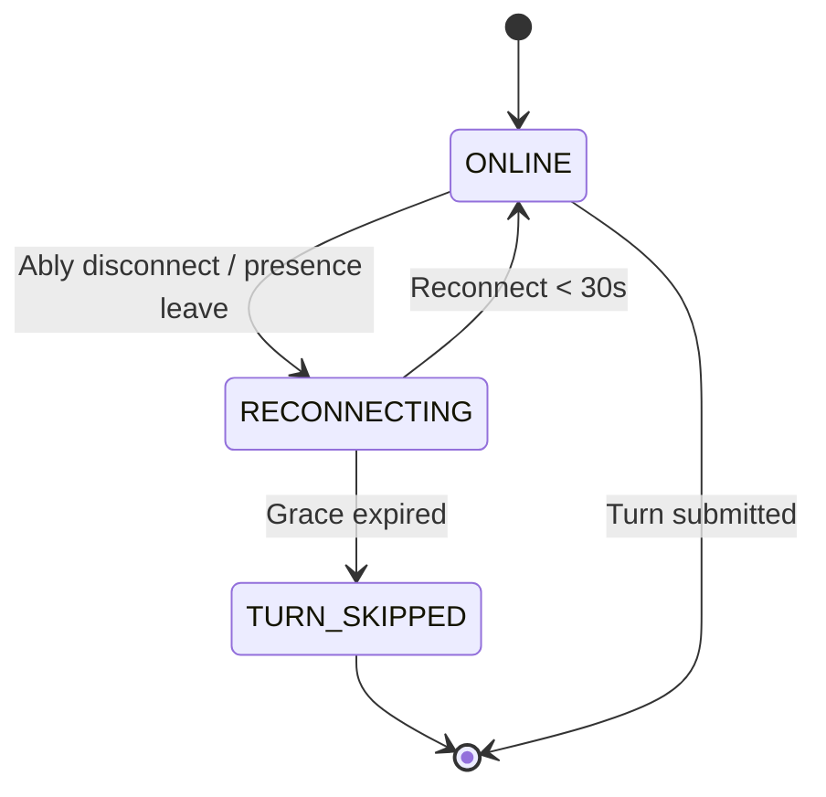
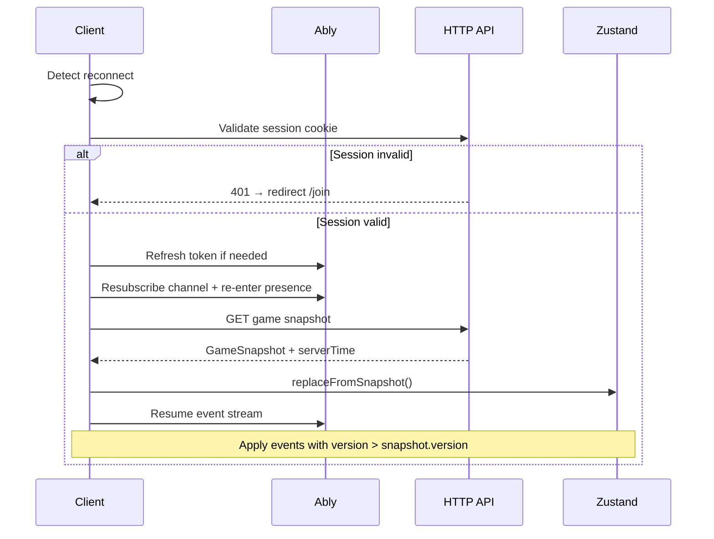
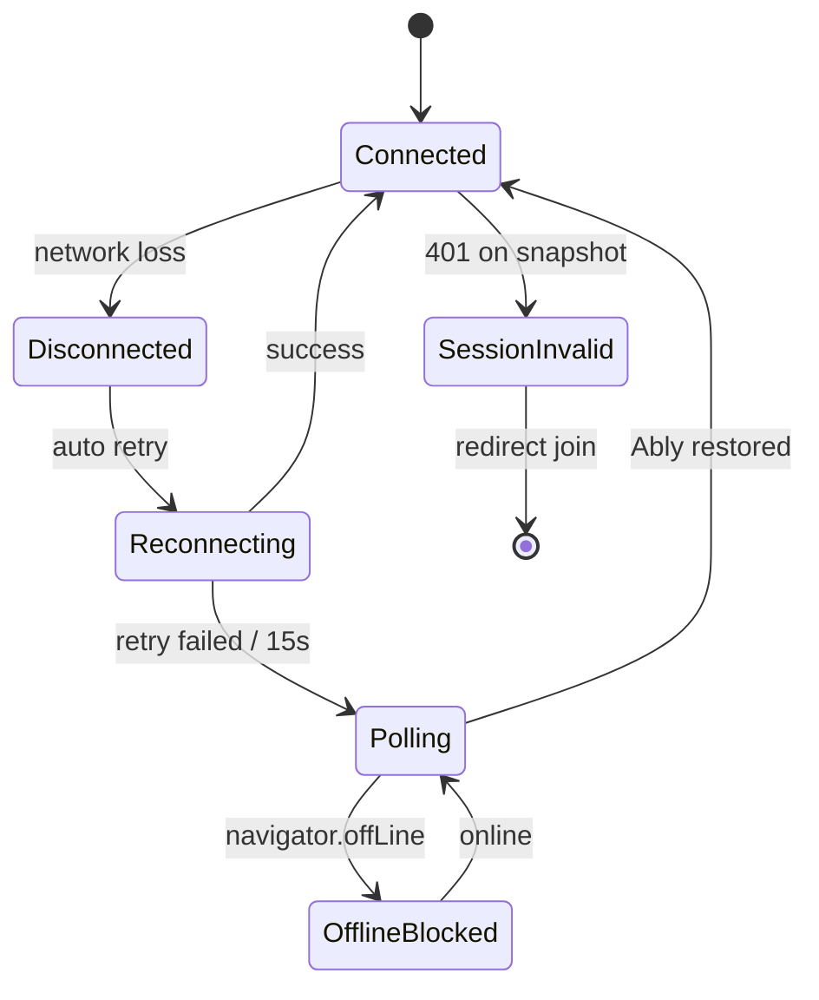

# Phase 5 — Document 3: Disconnect, Reconnect & Offline Recovery

## Overview

This document specifies how InkEcho handles **network instability** across the Ably layer, HTTP fallback, and game logic grace periods. It extends Phase 4 session recovery with realtime-specific behavior.

---

## Failure Modes

| Mode | Symptom | Layer |
|------|---------|-------|
| **Transient blip** | < 3s disconnect | Ably auto-reconnect |
| **Short disconnect** | 3–30s | Banner + hold turn |
| **Long disconnect** | > 30s | Turn skip; seat may remain |
| **Ably outage** | Regional failure | HTTP polling fallback |
| **Full offline** | No network | Read-only last state + queue (MVP: block submits) |
| **Tab backgrounded** | Mobile OS suspends WS | Reconnect on focus + snapshot |
| **Server deploy** | Brief 502 | Retry HTTP; Ably reconnects |

---

## Disconnect Detection

### Client Signals

| Signal | Source | Action |
|--------|--------|--------|
| Ably `disconnected` | Realtime SDK | Start reconnect timer |
| Ably `failed` | SDK max retries | Show failed banner |
| `window.offline` | Browser | Immediate banner |
| `window.online` | Browser | Force reconnect + snapshot |
| `document.visibilitychange` | Tab focus | Refresh token if near expiry; snapshot if hidden > 30s |
| Heartbeat miss | Optional | Polling fallback |

### Connection Status UI

```typescript
type RealtimeConnectionStatus =
  | 'connected'
  | 'connecting'
  | 'disconnected'    // > 3s without connection
  | 'polling'         // fallback mode
  | 'failed';
```

Mapped to `ReconnectBanner` (Phase 1 wireframe).

---

## Grace Period State Machine

Applies to **active player** during their turn:



| Constant | Default | Config |
|----------|---------|--------|
| `DISCONNECT_GRACE_MS` | 30000 | `shared/config/game.config.ts` |
| Banner show delay | 3000 | Avoid flash on blip |

### Server-Side Grace Implementation (MVP)

**Option A (chosen for MVP): Timer-based**

When turn starts, schedule job at `turnEndsAt` OR grace expiry — whichever logic applies for skip. Disconnect skip evaluated at:

```
if (activePlayer.connectionStatus === OFFLINE && offlineDuration > GRACE) {
  gameService.skipTurn(reason: 'DISCONNECT_TIMEOUT');
}
```

Connection status updated by:
- Client `POST /api/rooms/[code]/heartbeat` on reconnect
- Ably presence webhook (P1)
- Infer OFFLINE if no heartbeat for 30s during turn (cron)

**Option B (P1): Ably Presence webhook → server**

More accurate; requires Ably reactor/webhook endpoint.

---

## Reconnect Flow (Combined Auth + Realtime)



### Reconnect Checklist (Client)

1. Verify `ink_player_session` still valid (implicit on API call)
2. Refresh Ably token if `expiresIn < 5 min`
3. `channel.attach()` if detached
4. `presence.enter()` with updated data
5. Fetch HTTP snapshot
6. Replace Zustand if `snapshot.version >= local.version`
7. Hide `ReconnectBanner`
8. If active turn: restore describe draft from localStorage

---

## Ably Reconnect Configuration

```typescript
const ablyOptions: Ably.ClientOptions = {
  authCallback: async (_, callback) => {
    const token = await fetchAblyToken(roomId);
    callback(null, token);
  },
  disconnectedRetryTimeout: 1000,
  suspendedRetryTimeout: 10000,
  httpMaxRetryCount: 5,
};
```

Token refresh on every `authCallback` invocation — handles long sessions.

---

## Offline Recovery (MVP Scope)

### What Works Offline

| Feature | Offline behavior |
|---------|------------------|
| View last rendered UI | ✓ (stale) |
| Canvas drawing | ✓ (local strokes in memory) |
| Describe textarea | ✓ (local) |
| Submit turn | ✗ — queued not in MVP |
| Receive updates | ✗ |

### MVP: Block Submit When Offline

```typescript
if (!navigator.onLine || connectionStatus !== 'connected') {
  toast.error('Reconnect to submit');
  return;
}
```

Canvas draft autosaved to localStorage — survives refresh while offline.

### Post-MVP: Mutation Queue

```
Queue: [{ action: 'submitDescription', payload, expectedVersion }]
On reconnect: drain queue with version checks
Conflict → discard queue + snapshot resync
```

Not in MVP — complexity vs party game session length.

---

## HTTP Polling Fallback

Activated when Ably `failed` or disconnected > 15s:

```typescript
const POLL_INTERVAL_MS = 5000;

useEffect(() => {
  if (connectionStatus !== 'polling') return;
  const id = setInterval(() => {
    fetchGameSnapshot(roomCode).then(replaceFromSnapshot);
  }, POLL_INTERVAL_MS);
  return () => clearInterval(id);
}, [connectionStatus, roomCode]);
```

| Property | Value |
|----------|-------|
| Interval | 5s |
| Stop condition | Ably reconnected |
| Scope | Game phase only — lobby uses TanStack refetch |

**Rate limit consideration:** One poll per client per 5s — acceptable for degraded mode.

---

## Multi-Device Policy (MVP)

| Policy | Behavior |
|--------|----------|
| Same account, two tabs, same room | Both receive events; both can submit if same playerId cookie — **last write wins** |
| Same account, two devices | Separate sessions = separate playerIds if join twice — **discouraged** |
| MVP recommendation | Document as unsupported; first session wins |

P2: `playerId` session exclusivity — new connect kicks old Ably presence.

---

## Event Recovery After Reconnect

```
localVersion = 41
snapshot.version = 45
→ Full replace from snapshot (skip event replay)

localVersion = 44
snapshot.version = 44
→ Apply subsequent Ably events normally

localVersion = 46 (ahead of server — bug)
→ Full replace from snapshot (server wins)
```

Never keep local state ahead of server.

---

## Presence vs Game State on Disconnect

| Concern | Source of truth |
|---------|-----------------|
| Who is in the room | `RoomParticipant` DB + server events |
| Online dot indicator | Ably presence (best effort) |
| Whose turn it is | `Game.activePlayerId` DB |
| Timer | `Game.turnEndsAt` DB |

On presence/server mismatch: **DB wins** on next snapshot fetch.

---

## Mobile-Specific Recovery

| Scenario | Handling |
|----------|----------|
| iOS low power mode | Longer reconnect; polling fallback sooner |
| App background 30s+ | `visibilitychange` → snapshot refresh |
| Network switch WiFi→LTE | Ably reconnect; brief banner |
| Page freeze | Timer uses server epoch — no lost time |

```typescript
document.addEventListener('visibilitychange', () => {
  if (document.visibilityState === 'visible') {
    reconnectAndSync();
  }
});
```

---

## Server Deploy During Active Game

```
1. Vercel rolling deploy — brief in-flight request failures
2. Client HTTP retry 3x on 502/503
3. Ably connection may drop — auto reconnect
4. Game document version monotonic — no rollback
5. In-flight turn submit: idempotent retry safe
```

**Schema migration during live games:** Backward-compatible only (Phase 3 strategy).

---

## Ably Outage Runbook

| Step | Action |
|------|--------|
| 1 | Status page confirms Ably incident |
| 2 | All clients enter polling fallback automatically |
| 3 | Monitor MongoDB write rate (unchanged — HTTP still works) |
| 4 | Communicate via status banner optional |
| 5 | Post-incident: review publish failure logs |

Game remains playable in degraded mode — submits work via HTTP; other clients sync via polling.

---

## Integration with Phase 4 Auth

| Event | Auth action |
|-------|-------------|
| Reconnect | Re-validate guest JWT + GuestSession exists |
| Kicked while disconnected | Next API call returns 403; clear cookie |
| Room closed | `room_closed` event; clear session |
| Token expiry mid-game | Redirect re-join if turn not active; finish turn if API still accepts JWT until exp |

---

## Client Recovery State Diagram



---

## Testing Matrix

| ID | Test | Expected |
|----|------|----------|
| RT-1 | Kill WS 5s | Auto reconnect, no turn loss |
| RT-2 | Kill WS 35s on turn | Turn skipped, others advance |
| RT-3 | Offline → submit | Blocked with toast |
| RT-4 | Offline draw → refresh | Draft restored |
| RT-5 | Ably failed | Polling updates UI within 5s |
| RT-6 | Reconnect reveal | Correct step index |
| RT-7 | 8 players event fan-out | All sync within 500ms P95 |

---

## Implementation Files (M4)

| File | Responsibility |
|------|----------------|
| `use-ably-room.ts` | Connection lifecycle |
| `use-realtime-sync.ts` | Subscribe + dispatch |
| `event-reducer.ts` | Pure state transitions |
| `RealtimeProvider.tsx` | Context wrapper |
| `event-publisher.ts` | Server publish + retry |
| `ably-token.service.ts` | Token generation |
| `ReconnectBanner.tsx` | UI feedback |

---

## Related Documents

- Realtime overview: [01-realtime-architecture-overview.md](./01-realtime-architecture-overview.md)
- Sync protocol: [02-synchronization-and-conflict-resolution.md](./02-synchronization-and-conflict-resolution.md)
- Session recovery: [../phase-4/03-session-recovery.md](../phase-4/03-session-recovery.md)
- Acceptance criteria AC-11, AC-12: [../phase-0/05-acceptance-criteria.md](../phase-0/05-acceptance-criteria.md)

## Approval Gate

Phase 6 (backend architecture — repositories, services, controllers) begins after Phase 5 approval.
