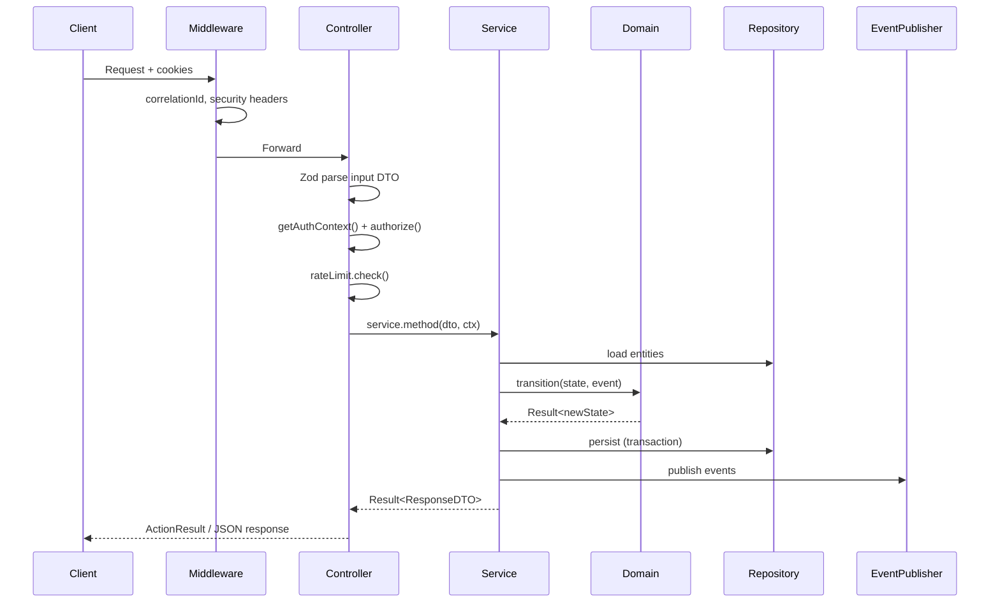

# Phase 6 — Document 1: Backend Architecture Overview

## Overview

InkEcho's backend runs on **Next.js 15 server runtime** (Server Actions + Route Handlers) with **Clean Architecture** layering. Business logic never lives in route files — they delegate to **application services**, which orchestrate **domain rules** and **repositories**.

**No separate Express server** — Vercel serverless functions are the deployment unit.

---

## Layer Stack

```
┌─────────────────────────────────────────────────────────────────┐
│  CONTROLLERS (Entry Points)                                      │
│  features/*/actions/*.ts          Server Actions                 │
│  app/api/**/route.ts              Route Handlers                 │
└────────────────────────────┬────────────────────────────────────┘
                             │ validate DTO → auth → call service
┌────────────────────────────▼────────────────────────────────────┐
│  APPLICATION SERVICES                                            │
│  features/*/services/*.ts         Use-case orchestration           │
└────────────────────────────┬────────────────────────────────────┘
                             │ domain transitions + repo calls
┌────────────────────────────▼────────────────────────────────────┐
│  DOMAIN                                                          │
│  domain/**/*.ts                   Pure rules & state machines    │
└────────────────────────────▲────────────────────────────────────┘
                             │ implements
┌────────────────────────────┴────────────────────────────────────┐
│  INFRASTRUCTURE                                                  │
│  infrastructure/db/repositories   Data access                    │
│  infrastructure/realtime          Ably publish                   │
│  infrastructure/storage           Cloudinary                     │
│  infrastructure/auth              Sessions                       │
│  infrastructure/cache             Rate limits                    │
└─────────────────────────────────────────────────────────────────┘
```

---

## Controllers vs Services

| Term | InkEcho mapping | Responsibility |
|------|-----------------|----------------|
| **Controller** | Server Action or Route Handler | HTTP boundary: parse, auth, respond |
| **Service** | `*Service` class in features | Single use case orchestration |
| **Repository** | `*Repository` in infrastructure | DB CRUD + optimistic lock |
| **Domain** | Pure functions in `domain/` | Rules without I/O |

**Controllers are thin** (~15–30 lines). Services contain workflow.

---

## Request Lifecycle



---

## Dependency Injection

No heavy DI framework — **factory module** composes dependencies:

File: `infrastructure/di/container.ts` (M2)

```typescript
// Singletons per serverless invocation (module cache)
export function createServices() {
  const logger = createRequestLogger(getCorrelationId());
  const gameRepo = new GameRepository(prisma, logger);
  const roomRepo = new RoomRepository(prisma, logger);
  const eventPublisher = new EventPublisher(logger);

  return {
    roomService: new RoomService(roomRepo, participantRepo, guestSessionService, eventPublisher, logger),
    gameService: new GameService(gameRepo, roomRepo, promptRepo, eventPublisher, cloudinary, logger),
    lobbyService: new LobbyService(roomRepo, participantRepo, gameService, eventPublisher, logger),
    // ...
  };
}
```

Controllers import `createServices()` — testable via constructor injection in unit tests.

---

## Service Catalog

| Service | Feature folder | Primary responsibilities |
|---------|----------------|------------------------|
| `GuestSessionService` | auth | Create/revoke guest JWT + DB |
| `RoomService` | rooms | CRUD rooms, join, leave, settings |
| `LobbyService` | lobby | Ready, kick, transfer host, start game |
| `GameService` | game | Turns, timer, pause, skip, complete |
| `RevealService` | reveal | Playback steps, votes, rematch |
| `ProfileService` | profile | Stats, history |
| `AdminService` | admin | Reports, bans |
| `AblyTokenService` | infrastructure/realtime | Token generation |
| `CloudinaryService` | infrastructure/storage | Drawing upload |

Cross-cutting: `RateLimiter`, `EventPublisher`, repositories.

---

## Transaction Boundaries

MongoDB via Prisma — use **`$transaction`** for multi-document writes:

| Operation | Documents touched |
|-----------|-------------------|
| Create room | Room + RoomParticipant + GuestSession |
| Join room | RoomParticipant + GuestSession + Room.participantIds |
| Start game | Room (status) + Game (create) + Room.currentGameId |
| Submit turn | Game (single doc — embedded chains) |
| Kick player | Participant + GuestSession revoke + Room.kickedPlayerIds |
| Game complete | Game + GameHistory[] + UserStats[] |

Single-document game updates **do not need transactions** — atomic `updateMany` with version.

---

## Controller Types

### Server Actions (Primary)

- Called from React components / forms
- Typed input/output
- `'use server'` directive
- Return `ActionResult<T>` — never throw to client

### Route Handlers (Secondary)

| Endpoint | Why Route Handler |
|----------|-------------------|
| `GET /api/realtime/token` | CORS, non-React clients |
| `POST /api/auth/*` | Better Auth |
| `GET /api/health` | Monitoring |
| `POST /api/cron/*` | Vercel cron + secret header |
| Public REST (Document 9) | External consumers |

Shared controller utilities in `shared/lib/api/`.

---

## Cross-Cutting Concerns

| Concern | Location | When |
|---------|----------|------|
| Validation | Zod schemas | Controller entry |
| Auth | `getAuthContext()`, `authorize()` | After validation |
| Rate limit | `RateLimiter` | Before service call |
| Logging | Pino child logger | Every layer |
| Errors | `handleActionError()` | Controller catch |
| Correlation ID | `request-context.ts` | Middleware → all logs |
| Ban check | `assertNotBanned()` | Auth layer |

---

## Domain Integration Pattern

```typescript
// GameService.submitDescription (simplified)
async submitDescription(dto: SubmitDescriptionDto, ctx: PlayerContext): Promise<Result<SubmitDescriptionResponse>> {
  const game = await this.gameRepo.findActiveByRoomId(dto.roomId);
  if (!game) return err(new NotFoundError('GAME_NOT_FOUND'));

  const transition = transitionGame(mapToDomain(game), {
    type: 'SUBMIT_DESCRIPTION',
    text: dto.text,
    playerId: ctx.playerId,
  });

  if (!transition.ok) return transition;

  const persist = await this.gameRepo.updateWithVersion(game.id, dto.expectedVersion, mapToPrisma(transition.value));
  if (!persist.ok) return persist;

  await this.eventPublisher.publishDescriptionSubmitted(dto.roomId, persist.value, correlationId);

  return ok(mapToResponseDto(persist.value, ctx.playerId));
}
```

Domain never imports Prisma types — mappers translate at repository boundary.

---

## File Organization Summary

```
features/game/
├── actions/           Controllers (Server Actions)
├── services/          GameService
├── schemas/           Zod input/output
└── types/             DTO interfaces

infrastructure/db/
├── repositories/      GameRepository, RoomRepository, ...
└── mappers/           game.mapper.ts, room.mapper.ts

domain/game/
├── game-state-machine.ts
└── visibility-filter.ts

shared/lib/
├── auth/authorize.ts
├── api/parse-request.ts
└── errors/
```

---

## Testing Strategy by Layer

| Layer | Test type | Mock |
|-------|-----------|------|
| Domain | Unit | None |
| Repository | Integration | Test MongoDB |
| Service | Unit + integration | Mock repos OR test DB |
| Controller | Integration | Mock services |
| E2E | Playwright | Full stack |

---

## Related Documents

- Repositories: [02-repositories-and-mappers.md](./02-repositories-and-mappers.md)
- Services: [03-application-services.md](./03-application-services.md)
- Controllers & DTOs: [04-controllers-dtos-validation.md](./04-controllers-dtos-validation.md)
- Middleware & errors: [05-middleware-and-errors.md](./05-middleware-and-errors.md)

## Approval Gate

Phase 7 (API contracts — no implementation) begins after Phase 6 approval.
