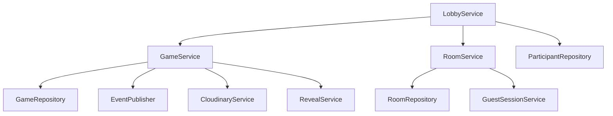

# Phase 6 — Document 3: Application Services

## Overview

Application services implement **use cases** — one service method = one user intent. They orchestrate repositories, domain transitions, external services (Ably, Cloudinary), and event publishing.

---

## Service Design Rules

| Rule | Detail |
|------|--------|
| Method naming | Verb + noun: `submitDescription`, `kickPlayer` |
| Input | DTO + `PlayerContext` or `AuthContext` |
| Output | `Result<ResponseDto, AppError>` |
| Size | ≤ 50 lines per method; extract private helpers |
| Transactions | Service opens `$transaction` when multi-doc |
| Events | Publish after successful persist only |
| Idempotency | Check already-applied state before transition |

---

## RoomService

File: `features/rooms/services/room.service.ts`

### `createRoom(dto, ctx)`

```
1. Rate limit: room create per user/IP
2. Generate unique room code (domain/room/room-code.ts)
3. Generate playerId UUID
4. Transaction:
   a. roomRepo.create({ code, settings, hostPlayerId, visibility })
   b. participantRepo.create({ HOST, playerId, displayName })
   c. guestSessionService.create(roomId, playerId, displayName)
5. Return { roomCode, roomId, playerId } + set cookie via action
```

### `joinRoom(dto, ctx)`

```
1. roomRepo.findByCode(dto.code)
2. Validate: not CLOSED, not deleted, not on kickedPlayerIds
3. If IN_PROGRESS/REVEAL → role SPECTATOR (if allowed)
4. If LOBBY → role PLAYER; check capacity
5. Transaction: participant + guestSession + update participantIds
6. eventPublisher.playerJoined
7. Return redirect target by room.status
```

### `leaveRoom(roomId, ctx)`

```
1. participantRepo.markLeft
2. Remove from participantIds
3. If host → promote next host (lobbyService.transferHostAuto)
4. If empty → roomRepo.close(EMPTY)
5. eventPublisher.playerLeft
6. Revoke guest session if applicable
```

### `updateSettings(roomId, dto, ctx)`

```
1. authorize host
2. Validate settings ranges (Zod + config)
3. roomRepo.updateSettings
4. eventPublisher.roomSettingsUpdated
```

---

## LobbyService

File: `features/lobby/services/lobby.service.ts`

### `toggleReady(roomId, isReady, ctx)`

```
1. participantRepo.updateReady
2. eventPublisher.playerReadyChanged
```

### `kickPlayer(roomId, targetPlayerId, ctx)`

```
1. authorize host; cannot kick self
2. participantRepo.markLeft
3. roomRepo.addKickedPlayer
4. guestSessionRepo.delete for target
5. eventPublisher.playerKicked
```

### `transferHost(roomId, newHostPlayerId, ctx)`

```
1. authorize host
2. participantRepo.updateRole(old → PLAYER, new → HOST)
3. roomRepo.update hostPlayerId
4. eventPublisher.hostChanged
```

### `startGame(roomId, ctx)`

```
1. authorize host
2. Load participants — count ready ≥ minPlayers
3. gameService.createAndStart(roomId, participants)  ← delegates
4. roomRepo.updateStatus(IN_PROGRESS)
5. roomRepo.setCurrentGameId
6. eventPublisher.gameStarted
```

---

## GameService

File: `features/game/services/game.service.ts`

### `createAndStart(roomId, participants)`

```
1. Shuffle playerOrder (domain/game/turn-order.ts)
2. Build chains from roundCount + promptPoolRepo.randomActive
3. Build initial turns array (domain/game/chain-builder.ts)
4. gameRepo.create({ status: IN_PROGRESS, version: 1, first turn })
5. Return game entity
```

### `submitDescription(dto, ctx)`

```
1. Load active game; authorize activePlayerId === ctx.playerId
2. Idempotent check if turn already submitted
3. domain transitionGame(SUBMIT_DESCRIPTION)
4. gameRepo.updateWithVersion
5. Compute next turn / chain complete / reveal
6. eventPublisher.descriptionSubmitted + turnChanged
7. If chain/game complete → trigger revealService or completeGame
8. Return SubmitDescriptionResponseDto (filtered)
```

### `submitDrawing(dto, ctx, imageBuffer)`

```
1. Same auth as describe
2. cloudinaryService.upload(imageBuffer) → url, publicId
3. domain transitionGame(SUBMIT_DRAWING)
4. gameRepo.updateWithVersion with drawingUrl on turn
5. eventPublisher.drawingSubmitted + turnChanged
6. Return response
```

### `processTimerExpiry(gameId)`

```
1. Load game — verify turnEndsAt <= now
2. domain transitionGame(TIMER_EXPIRED)
3. Auto-submit empty/skipped content
4. updateWithVersion + events
```

Called by: Vercel cron or inline check on next mutation.

### `skipTurn(gameId, playerId, reason)`

```
1. domain transitionGame(SKIP_TURN)
2. updateWithVersion + turn_skipped event
```

### `pauseGame(roomId, ctx)` / `resumeGame(roomId, ctx)`

```
1. authorize host
2. domain transition pause/resume
3. Store pauseRemainingMs on pause
4. Recalculate turnEndsAt on resume
5. Publish game_paused / game_resumed
```

### `getSnapshot(roomId, ctx)`

```
1. Load game + room
2. map to GameSnapshotDto with visibility filter for ctx.playerId
3. Include serverTime for timer sync
```

---

## RevealService

File: `features/reveal/services/reveal.service.ts`

### `startReveal(gameId)`

```
1. gameRepo.update status REVEAL, revealChainIndex=0, revealStepIndex=0
2. roomRepo.updateStatus REVEAL
3. eventPublisher.revealStarted
4. Schedule step publishing (see below)
```

### `publishRevealStep(gameId)`

```
1. Load game reveal indices
2. Build step content from chains (full content — reveal phase)
3. eventPublisher.revealChainStep
4. Increment revealStepIndex in DB
5. If chain done → next chain or revealCompleted
```

**Scheduler options:**

| Option | MVP |
|--------|-----|
| Inline setTimeout in serverless | ✗ unreliable |
| Cron polling reveal state | ✓ simple |
| Ably scheduled messages | P1 |

MVP: **Client-driven auto-advance** with server validation on step boundary OR cron every 3s checks `revealStepIndex` advance queue.

*Design choice for MVP:* Server publishes all steps via **sequential service call in `startReveal` loop with await delay** only works in long-running process. For serverless: **client auto-advance timer** syncs to `revealStepIndex` in DB; host client or any client calls `advanceRevealStep` action every 3s OR server cron advances.

**Finalized MVP:** Cron `/api/cron/advance-reveal` every 2s for rooms in REVEAL.

### `voteChain(dto, ctx)` / `rematch(roomId, ctx)`

```
vote: update Game.votes.counts JSON, publish update
rematch: game complete → room LOBBY, reset participants ready, returned_to_lobby event
```

---

## GuestSessionService

File: `features/auth/services/guest-session.service.ts`

| Method | Flow |
|--------|------|
| `create(roomId, displayName)` | Insert DB + sign JWT |
| `verify(token, roomId?)` | Verify JWT + load DB + check expiry |
| `revoke(sessionId)` | Delete DB record |
| `refreshLastSeen(sessionId)` | Update lastSeenAt |

---

## ProfileService

| Method | Flow |
|--------|------|
| `getProfile(userId)` | User + stats |
| `getHistory(userId, pagination)` | gameHistoryRepo.listByUser |
| `updateProfile(userId, dto)` | userRepo.updateProfile |

---

## AdminService

| Method | Flow |
|--------|------|
| `listReports(pagination)` | reportRepo.listPending |
| `reviewReport(id, action, adminCtx)` | Update report + optional userRepo.banUser |
| `banUser(userId, options, adminCtx)` | userRepo.ban + audit log |

---

## EventPublisher (Infrastructure Service)

File: `infrastructure/realtime/event-publisher.ts`

Typed methods — never raw publish strings:

```typescript
class EventPublisher {
  async publishTurnChanged(roomId: string, game: GameEntity, correlationId: string): Promise<void>;
  async publishPlayerJoined(roomId: string, participant: ParticipantEntity, ...): Promise<void>;
  // one method per event type or grouped by domain
}
```

Each method builds `RealtimeEnvelope` with correct `version` and `scope`.

---

## CloudinaryService

| Method | Flow |
|--------|------|
| `uploadDrawing(buffer, roomId, gameId, turnId)` | Signed upload → `{ url, publicId }` |
| `deleteDrawing(publicId)` | Admin/moderation cleanup |

---

## Service Interaction Diagram



---

## Related Documents

- Repositories: [02-repositories-and-mappers.md](./02-repositories-and-mappers.md)
- Controllers: [04-controllers-dtos-validation.md](./04-controllers-dtos-validation.md)
- Game state machine: [../phase-0/11-game-state-machine.md](../phase-0/11-game-state-machine.md)
