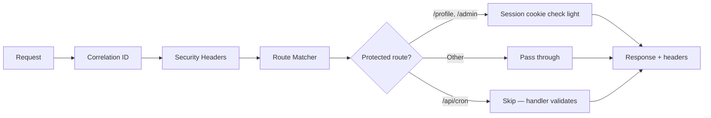
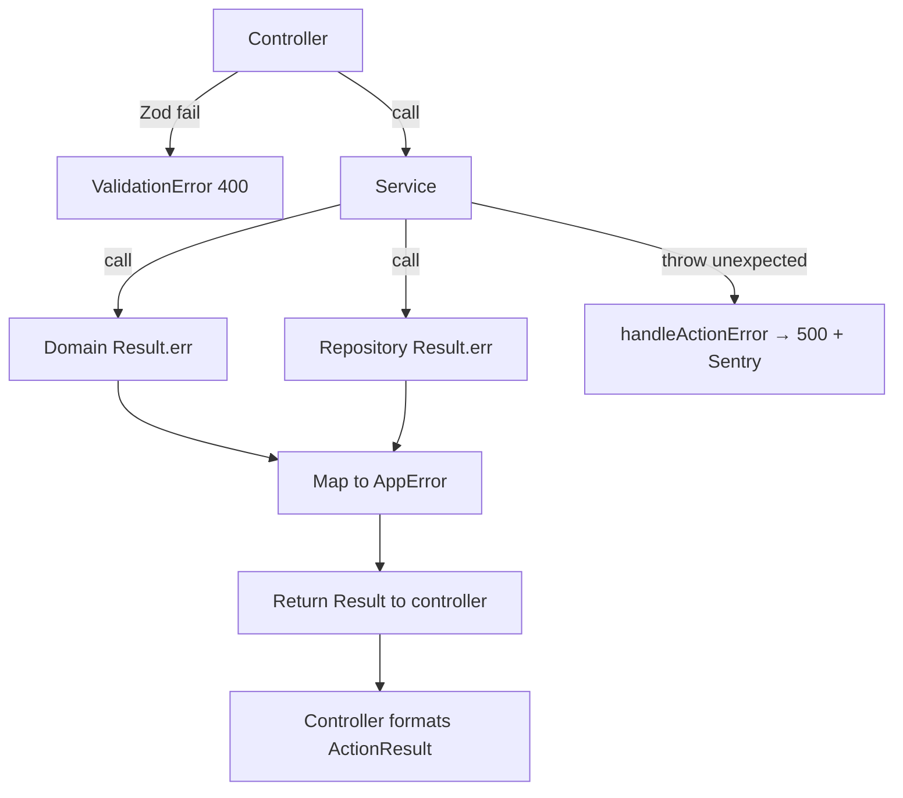

# Phase 6 — Document 5: Middleware & Error Handling

## Overview

Middleware handles **cross-cutting HTTP concerns** before controllers run. Error handling provides a **unified path** from domain/service failures to client-safe responses and observability.

---

## Middleware Architecture

File: `middleware.ts` (project root)



### Matcher Config

```typescript
export const config = {
  matcher: [
    '/((?!_next/static|_next/image|favicon.ico|public).*)',
  ],
};
```

---

## Middleware Responsibilities

| Step | Implementation | Notes |
|------|----------------|-------|
| Correlation ID | Read `x-correlation-id` or generate UUID | Set on request + response headers |
| Security headers | CSP, HSTS, X-Frame-Options | See Document 13 |
| Auth redirect | `/profile/*`, `/admin/*` — check session cookie exists | Full validation in controller |
| No Prisma in middleware | Edge runtime limitation | Heavy auth in Server Actions |

### Security Headers (Production)

```typescript
response.headers.set('X-Content-Type-Options', 'nosniff');
response.headers.set('X-Frame-Options', 'DENY');
response.headers.set('Referrer-Policy', 'strict-origin-when-cross-origin');
response.headers.set('Strict-Transport-Security', 'max-age=63072000; includeSubDomains');
```

---

## Request Context

File: `infrastructure/monitoring/request-context.ts`

```typescript
import { headers } from 'next/headers';
import { AsyncLocalStorage } from 'async_hooks';

export async function getCorrelationId(): Promise<string> {
  const h = await headers();
  return h.get('x-correlation-id') ?? crypto.randomUUID();
}

export function createRequestLogger(correlationId: string) {
  return logger.child({ correlationId });
}
```

Pass `correlationId` to all service/repository calls for log tracing.

---

## Error Hierarchy (Implementation Map)

File: `shared/lib/errors/app-error.ts`

| Class | HTTP | Code prefix |
|-------|------|-------------|
| `ValidationError` | 400 | `VALIDATION_` |
| `UnauthorizedError` | 401 | `UNAUTHORIZED` |
| `ForbiddenError` | 403 | `FORBIDDEN`, `NOT_HOST`, `BANNED` |
| `NotFoundError` | 404 | `NOT_FOUND`, `ROOM_NOT_FOUND` |
| `ConflictError` | 409 | `VERSION_CONFLICT`, `GAME_ALREADY_STARTED` |
| `GameStateError` | 409 | `INVALID_GAME_TRANSITION` |
| `RateLimitError` | 429 | `RATE_LIMITED` |
| `PayloadTooLargeError` | 413 | `FILE_TOO_LARGE` |
| `ExternalServiceError` | 502 | `EXTERNAL_SERVICE_ERROR` |

### Domain → Application Error Mapping

```typescript
// domain returns Result — service maps to AppError
function mapDomainError(error: DomainError): AppError {
  switch (error.code) {
    case 'NOT_YOUR_TURN': return new ForbiddenError('NOT_YOUR_TURN', error.message);
    case 'INVALID_TRANSITION': return new GameStateError(error.message);
    default: return new ForbiddenError(error.code, error.message);
  }
}
```

---

## Error Handlers

### Server Actions — `handleActionError`

File: `shared/lib/errors/handle-action-error.ts`

```typescript
export function handleActionError(error: unknown, correlationId: string): ActionFailure {
  if (error instanceof ZodError) {
    return {
      success: false,
      error: {
        code: 'VALIDATION_ERROR',
        message: 'Please check your input.',
        correlationId,
        details: error.errors.map(e => ({ field: e.path.join('.'), message: e.message })),
      },
    };
  }

  if (error instanceof AppError) {
    logger.warn({ err: error, correlationId }, error.code);
    return {
      success: false,
      error: {
        code: error.code,
        message: error.message,
        correlationId,
        ...(error.context?.snapshot ? { snapshot: error.context.snapshot } : {}),
      },
    };
  }

  logger.error({ err: error, correlationId }, 'Unhandled error');
  Sentry.captureException(error, { tags: { correlationId } });

  return {
    success: false,
    error: {
      code: 'INTERNAL_ERROR',
      message: 'Something went wrong. Try again.',
      correlationId,
    },
  };
}
```

### Route Handlers — `handleApiError`

File: `shared/lib/errors/handle-api-error.ts`

```typescript
export function handleApiError(error: unknown, correlationId: string): NextResponse {
  const payload = toErrorPayload(error, correlationId);
  const status = error instanceof AppError ? error.statusCode : 500;
  return NextResponse.json({ error: payload }, {
    status,
    headers: { 'x-correlation-id': correlationId },
  });
}
```

---

## Error Flow by Layer



**Rule:** Domain and repositories **return Result** — only controllers catch and format.

---

## VERSION_CONFLICT Special Case

```typescript
if (error.code === 'VERSION_CONFLICT' && error.context?.snapshot) {
  return {
    success: false,
    error: {
      code: 'VERSION_CONFLICT',
      message: 'State updated. Syncing…',
      correlationId,
      snapshot: error.context.snapshot as GameSnapshotDto,
    },
  };
}
```

Client replaces Zustand state from `error.snapshot`.

---

## Logging Integration

| Error type | Log level | Sentry |
|------------|-----------|--------|
| ValidationError | debug/warn | Breadcrumb only |
| AppError operational | warn | Breadcrumb |
| VERSION_CONFLICT | warn | No |
| ExternalServiceError | error | captureException |
| Unhandled | error | captureException |

```typescript
logger.warn({
  correlationId,
  action: 'game.submit_conflict',
  gameId,
  expectedVersion,
  actualVersion: snapshot.version,
}, 'Version conflict');
```

See Document 18 for full logging spec.

---

## Middleware vs Controller Auth Split

| Check | Middleware | Controller |
|-------|------------|------------|
| Cookie exists | ✓ light | — |
| JWT/Session valid | — | ✓ full + DB |
| Room membership | — | ✓ |
| Role permissions | — | ✓ authorize() |
| Ban status | — | ✓ assertNotBanned |

---

## Global Error Boundaries (Presentation)

| File | Catches |
|------|---------|
| `app/error.tsx` | Unhandled RSC errors |
| `app/not-found.tsx` | 404 pages |
| Feature ErrorBoundary | Game canvas failures |

Error boundaries **do not** catch Server Action errors — those return via `ActionResult`.

---

## Prisma Error Mapping

File: `infrastructure/db/prisma-errors.ts`

```typescript
export function mapPrismaError(error: unknown): AppError {
  if (error instanceof Prisma.PrismaClientKnownRequestError) {
    if (error.code === 'P2025') return new NotFoundError('Record not found');
    if (error.code === 'P2002') return new ConflictError('DUPLICATE');
  }
  return new ExternalServiceError('Database error');
}
```

Wrap in repository catch blocks.

---

## External Service Errors

| Service | Retry | Client message |
|---------|-------|----------------|
| Ably publish | 3x in EventPublisher | N/A (async) |
| Cloudinary upload | 2x in service | "Upload failed, try again" |
| MongoDB timeout | 1x | "Service temporarily unavailable" |
| Upstash rate limit down | Fail open with log | — |

---

## Testing Error Paths

| Test | Assert |
|------|--------|
| Invalid Zod input | 400 + details array |
| Wrong turn submit | 403 NOT_YOUR_TURN |
| Version mismatch | 409 + snapshot in body |
| Missing session | 401 |
| Banned user join | 403 BANNED |
| Unhandled throw | 500 + generic message; Sentry mock called |

---

## Related Documents

- Document 17: [../phase-0/17-error-handling-strategy.md](../phase-0/17-error-handling-strategy.md)
- Document 18: [../phase-0/18-logging-strategy.md](../phase-0/18-logging-strategy.md)
- Controllers: [04-controllers-dtos-validation.md](./04-controllers-dtos-validation.md)
- Security: [../phase-0/13-security-design.md](../phase-0/13-security-design.md)

## Approval Gate

Phase 7 (API contracts — formal OpenAPI-style specs, no implementation) begins after Phase 6 approval.

## M1 Completion Note

Phase 7 is the **final design phase** before Milestone 2 (project setup & code). After Phase 7 approval, implementation begins with M2 scaffolding.
